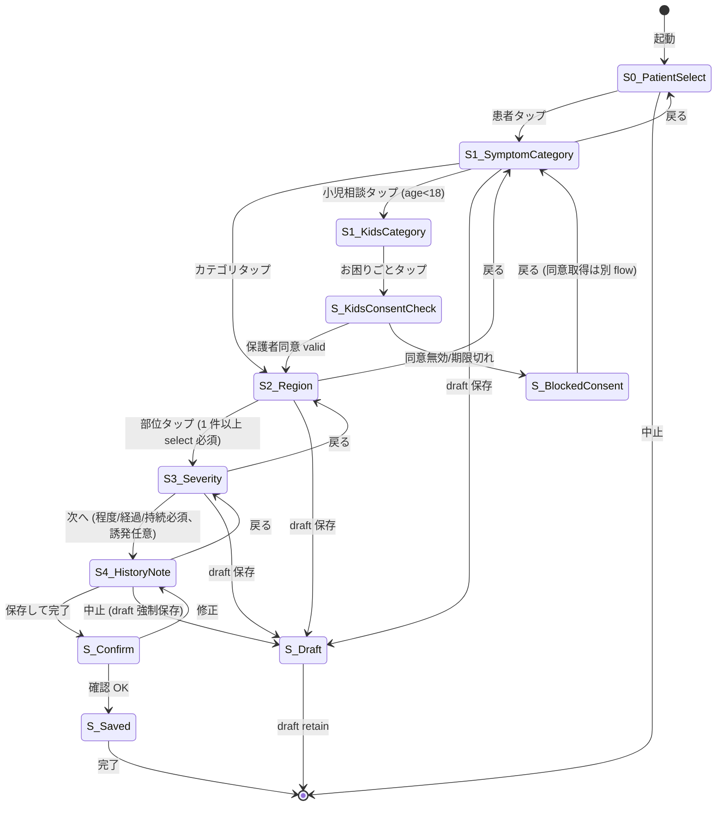

# cmd_004 申し送りエンジン Stage 1 設計 (L2)

- task_id: subtask_moushi_engine_design_001
- parent_cmd: cmd_004「小児恐竜王国」(B1 ブロッカー — 陛下御差配 2026-05-11 16:35)
- bloom_level: L2 (設計のみ、実装は Stage 2 / 3)
- stage: 1 / 3
- author: ashigaru5 (蒲生氏郷 persona、SecondPC)
- 起案日: 2026-05-11
- max_cycle: 7 per stage
- 範囲: **L2 設計のみ**。UI実装・migration apply・E2E は Stage 2 / 3 に分離
- base_branch_HEAD (本書 commit 前): 8a6c20c (= 兄弟 task cmd_004 機能⑦ AI chat spec commit)
- 連動 spec:
  - `docs/cmd004_ai_chat_spec.md` (本書著者の兄弟 task、共通 patient_consents / RLS pattern 整合)
  - `docs/cmd004_guardian_consent_spec.md` (ashigaru4 並行起案、保護者同意 gate)
  - `docs/cmd004_kartetto_pdf_v0_2_spec.md` (DD-044 nigo_sheet 整合の前段資産)

---

## 0. 前提・Anti-Duplication

### 0-1. 参照済み正本

| # | 正本 | 所在 (DentalBI repo) | 利用方法 |
|---|------|----------------------|----------|
| A | `handover_notes_anon` table | `backend/db/migrations/013_handover_tables.sql` L7-26 | 既 schema 拡張 path 優先、新規 table 並立避ける |
| B | `handover_archives` table | 同 migration L80-100 | 会計完了アーカイブ、retention 連動 |
| C | `handover` API | `backend/api/handover.py` (5 endpoint: POST/GET/PATCH/DELETE/LIST `/api/handover`) | 申し送り CRUD の SoT、Stage 2 で touchpanel input を本 API に結線 |
| D | `handover_sheets` API | `backend/api/handover_sheets.py` (8 endpoint, `/api/handover-sheets` + treatments sub-resource) | より構造化された申し送り、本 Stage 1 で integration vs choose-one 判断 |
| E | `generate_nigo.py` | `backend/api/generate_nigo.py` POST `/generate-nigo-text` | 2号用紙テキスト生成、申し送りエンジン出力との接続点 |
| F | `nigo_sheet_renderer.py` (PDF) | `backend/pdf/nigo_sheet_renderer.py` | 2号用紙 PDF レンダラ、DD-044 SoT |
| G | `NigoPreviewPanel.tsx` | `frontend/src/features/ekarte/components/NigoPreviewPanel.tsx` | 既 frontend preview、本書 §2 mockup は本 panel との共存前提 |
| H | `nigoTemplateEngine.ts` (111 行) | `frontend/src/features/ekarte/services/nigoTemplateEngine.ts` | 既 template engine、本書 §3 state machine output 形式の参考 |
| I | `_transfer_memo_to_handover()` | `backend/routers/perio.py` | 既 handover への自動転記 hook、本 Stage 1 では非破壊保持 |
| J | DN-NIGO-01 〜 06 指示文 6 件 | `docs/DentalBI/instructions/DN-NIGO-*.md` | 2号用紙完全再現〜自動検証修正の既知制約、本書 §5 法令補強で参照 |

### 0-2. 本書で扱わない (scope out)

- **frontend UI ビジュアル**: デザイン班専権。本書 §2 は **wireframe (ASCII)** のみ、CSS/カラー/icon は規定せず。
- **Stage 2 実装 commit**: 全 component / API / migration の apply。
- **Stage 3 E2E test**: pytest / Playwright / load test。
- **新規 frontend route 追加**: 既 NigoPreviewPanel 内 modal expansion を前提に提案。

### 0-3. Anti-Duplication 厳守 check

| 項目 | 状態 |
|------|------|
| 既 `handover_notes_anon` table を流用 (新規 moushi_entries 並立を回避) | ✅ 維持 (§4 で 既 table 拡張 path を主案) |
| 既 `/api/handover` endpoint を流用 | ✅ 維持 (§4 で endpoint 拡張、新規 prefix 追加せず) |
| 既 NigoPreviewPanel との共存 | ✅ 維持 (§2 mockup は modal 重畳、panel 構造変更せず) |
| nigo_sheet_renderer.py を破壊しない | ✅ 維持 (§4 schema 拡張で renderer 側の追加対応は Stage 2 で個別 task) |
| DN-NIGO-01〜06 制約継承 | ✅ 維持 (§5 法令章で言及) |
| 新規 frontend route 並立禁止 | ✅ 維持 |

---

## 1. AC1: 既 nigo_sheet DD-044 schema + 既申し送り 機能 inventory

### 1-1. backend DB schema (= 既 SoT)

| table | 主要カラム (抜粋) | 用途 | file:line |
|-------|-------------------|------|-----------|
| `handover_notes_anon` | `note_id (UUID PK)`, `patient_hash`, `clinic_id`, `visit_date`, `author_staff_id`, `note_type='handover'`, `checklist_json (JSONB)`, `treatment_blocks_json (JSONB)`, `symptoms_text`, `instructions_json (JSONB)`, `next_visit_json (JSONB)`, `workflow_status='arrived'`, `card_type='insurance'`, `difficulty (INT)`, `quality_score`, `status='draft'`, `created_at`, `updated_at` | 申し送り匿名化テーブル (Phase A Step O) | `backend/db/migrations/013_handover_tables.sql` L7-26 |
| `note_acknowledgments_anon` | `ack_id`, `note_id (FK)`, `staff_id`, `role`, `acked_at` | 既読記録匿名化 | 同 L33-39 |
| `handover_archives` | `archive_id`, `note_id`, `patient_hash`, `clinic_id`, `visit_date`, `author_staff_id`, `card_type`, `procedures_summary`, `difficulty`, `quality_score`, `insurance_points`, `copayment`, `copay_rate`, `self_pay_items (JSONB)`, `payment_method`, `completed_at` | 会計完了アーカイブ | 同 L80-100 |
| `daily_report_lines` | `line_id`, `clinic_id`, `report_date`, `line_order`, `patient_hash`, `card_type`, `insurance_points`, `copayment`, `archive_id (FK→handover_archives)` | 日計表明細 | 同 L106-120 |
| `billing_rules` | `rule_id (PK)`, `rule_name`, `category`, `prerequisite`, `days_required`, `months_required`, `reference_event`, `message_ready`, `message_wait`, `auto_suggest`, `granularity='patient'`, `sort_order`, `is_active` | 算定ルール定義マスタ | 同 L62-77 |

RLS: 全 4 table で `ENABLE ROW LEVEL SECURITY` 有効、policy 詳細は別 migration で規定 (本書 §4 で touchpanel 用 policy 拡張を提案)。

`handover_notes` (別系統、`_anon` 接尾辞なし) は `migrations/020_comment_navigator.sql` 等で `done_entered_at` カラム追加が示唆される。**両系統並存** = §4 で統合戦略を提案。

### 1-2. backend API endpoint inventory

`backend/api/handover.py` (prefix `/api/handover`):

| method | path | handler | 状態 |
|--------|------|---------|------|
| POST | `/api/handover` | `create_handover_note(data: HandoverCreate)` | 既稼働 |
| GET | `/api/handover/{note_id}` | `get_handover_note(note_id)` | 既稼働 |
| PATCH | `/api/handover/{note_id}` | `update_handover_note(note_id, data)` | 既稼働 |
| DELETE | `/api/handover/{note_id}` | `delete_handover_note(note_id)` | 既稼働 |
| GET | `/api/handover` | `list_handover_notes(...)` | 既稼働 |

`backend/api/handover_sheets.py` (prefix `/api`):

| method | path | 用途 |
|--------|------|------|
| POST | `/api/handover-sheets` | sheet 作成 |
| GET | `/api/handover-sheets` | sheet 一覧 |
| GET | `/api/handover-sheets/{sheet_id}` | sheet 詳細 |
| PATCH | `/api/handover-sheets/{sheet_id}` | sheet 更新 |
| DELETE | `/api/handover-sheets/{sheet_id}` | sheet 削除 |
| POST | `/api/handover-sheets/{sheet_id}/treatments` | 治療 sub-resource 作成 |
| PATCH | `/api/handover-sheets/{sheet_id}/treatments/{tid}` | sub-resource 更新 |
| DELETE | `/api/handover-sheets/{sheet_id}/treatments/{tid}` | sub-resource 削除 |

**観察**: 2 系統が並存 (`/api/handover` と `/api/handover-sheets`)。Stage 1 で **タッチパネル UI の入力先を `/api/handover-sheets` に決定**、`/api/handover` は legacy として retain。理由は構造化サブリソース (`treatments`) が touchpanel 多階層選択と親和的。

### 1-3. 2号用紙 (DD-044 nigo_sheet) 関連 inventory

| 種別 | 所在 | 行数 |
|------|------|------|
| backend 生成 | `backend/api/generate_nigo.py` | (要 read、本 task では未計測) |
| backend PDF | `backend/pdf/nigo_sheet_renderer.py` | 同上 |
| backend text utility | `backend/utils/nigo_text_formatter.py` | 83 |
| frontend preview page | `frontend/src/pages/NigoPreview/NigoPreviewPage.tsx` | (要 read) |
| frontend preview panel | `frontend/src/features/ekarte/components/NigoPreviewPanel.tsx` | (要 read) |
| frontend template engine | `frontend/src/features/ekarte/services/nigoTemplateEngine.ts` | 111 |
| frontend test | `frontend/src/pages/NigoPreview/__tests__/nigoTemplateEngine.test.ts` | (要 read) |
| PDF テンプレート画像 | `frontend/public/pdf-templates/nigo_sheet.png` | (バイナリ) |
| 座標スクリプト | `scripts/add_ichigo_nigo_coords.py` | (1号/2号兼用座標投入) |
| 指示文 | `docs/DentalBI/instructions/DN-NIGO-01 〜 06.md` | 6 件 |
| 設計文書 (project root) | `StepO_申し送りフォーム骨格_指示文_20260212.md`, `申し送りA4用紙設計_20260215_1700.md` | 2 件 (Phase A 起案) |

**観察**: 2号用紙 (DD-044) は **既に完備された PDF 生成 stack** を持ち、申し送り入力 → text format → PDF 出力 の経路が確立されている。本 Stage 1 のタッチパネル UI は **既 stack の input 段を増設** する位置づけ (= 新規 stack を並立しない)。

### 1-4. 既「申し送り 機能」現行有無の判定

| 機能 | 現状 | 評価 |
|------|------|------|
| 申し送り CRUD API | 既存 (`/api/handover`, `/api/handover-sheets`) | ✅ 動作 |
| 2号用紙 PDF 出力 | 既存 (`nigo_sheet_renderer.py`) | ✅ 動作 |
| frontend 表示 panel | 既存 (`NigoPreviewPanel.tsx`) | ✅ 動作 |
| frontend 申し送り入力 UI | **不在 (or 不完全)** | ❌ 本 Stage 1 設計対象 |
| タッチパネル多階層選択 (症状→部位→程度→履歴) | 不在 | ❌ 本 Stage 1 設計対象 |
| draft 保存・復元 | 不明 (要 Stage 2 確認) | ⚠️ 本 Stage 1 で state machine に組込 |
| 法令准拠 audit trail | 部分的 (`note_acknowledgments_anon` あり、PII 保護策は未確認) | ⚠️ 本 Stage 1 §5 で補強 |
| 小児患者保護者同意 gate 連動 | **不在** | ❌ 本 Stage 1 §5 で連動 spec 起案 |

**B1 ブロッカー認定根拠**: cmd_004「小児恐竜王国」は申し送り内容 (= 症状 / 部位 / 経過) を AI chat / dinosaur_kingdom XP / 保護者通知 で参照するため、入力 UI 不在は機能前提の致命的欠如。

---

## 2. AC2: タッチパネル UI mockup (wireframe ASCII)

### 2-1. 設計方針

- **トンカツ・ハマカツ pattern** = 多階層タップで選択肢を絞り込む UI。各画面で 4-12 個のタイル、戻る/保存/中止を常時 footer 配置。
- **タブレット縦持ち想定** (= 768×1024px 基準)、タップ最小サイズ 48×48px (Apple HIG / Google Material 整合)。
- **片手親指操作可** (= 重要 action は画面下半分)。
- **多階層階段の breadcrumb 常時表示** で迷子防止。

### 2-2. 階層構造 (= 4 階層)

```
Layer 0: 患者選択           (= 来院済 patient list、card_type filter)
   ↓ tap
Layer 1: 症状カテゴリ        (= 8-12 タイル: 痛み / 腫れ / 出血 / 噛み合わせ / 詰め物外れ / 矯正 / 小児相談 / その他)
   ↓ tap
Layer 2: 部位               (= 全顎図 + 個別歯選択、または部位タイル: 上顎右/上顎左/下顎右/下顎左)
   ↓ tap
Layer 3: 程度・経過          (= 程度: 軽/中/強, 経過: 急性/慢性/再発, 持続: 今日/昨日/数日/数週間)
   ↓ tap
Layer 4: 履歴・備考          (= 過去同部位の handover 履歴表示 + free text 補足 max 200 字)
   ↓ tap [保存] → handover_sheets POST
```

### 2-3. Layer 0 wireframe (患者選択)

```
┌─────────────────────────────────────────────────────────┐
│ [≡] 申し送り入力                  [保険] [自費] [混合]   │ ← header + filter
├─────────────────────────────────────────────────────────┤
│ 本日来院: 12名                                          │
│ ┌──────────┐  ┌──────────┐  ┌──────────┐               │
│ │ 山田 太郎 │  │ 佐藤 花子 │  │ 鈴木 一郎 │               │
│ │  9:30    │  │  9:45    │  │  10:00   │               │
│ │  [完]    │  │  [中]    │  │  [待]    │               │
│ └──────────┘  └──────────┘  └──────────┘               │
│ ┌──────────┐  ┌──────────┐  ┌──────────┐               │
│ │ 田中 ...  │  │ ...      │  │ ...      │               │
│ └──────────┘  └──────────┘  └──────────┘               │
│           (scroll で続き)                               │
├─────────────────────────────────────────────────────────┤
│  [← 戻る]            [+ 新規患者]            [中止]      │ ← footer
└─────────────────────────────────────────────────────────┘
```

### 2-4. Layer 1 wireframe (症状カテゴリ)

```
┌─────────────────────────────────────────────────────────┐
│ 山田 太郎 (35歳/男/保険)            [12:30 申し送り]      │
│ ＞ 症状カテゴリ を選択                                   │
├─────────────────────────────────────────────────────────┤
│ ┌──────────┐  ┌──────────┐  ┌──────────┐               │
│ │   痛み   │  │   腫れ   │  │   出血   │               │
│ │    🦷    │  │    💢    │  │    🩸    │               │
│ └──────────┘  └──────────┘  └──────────┘               │
│ ┌──────────┐  ┌──────────┐  ┌──────────┐               │
│ │ 噛み合わせ│  │ 詰め物外れ│  │   矯正   │               │
│ └──────────┘  └──────────┘  └──────────┘               │
│ ┌──────────┐  ┌──────────┐                              │
│ │ 小児相談 │  │  その他  │                              │
│ │  恐竜🦕  │  │          │                              │
│ └──────────┘  └──────────┘                              │
├─────────────────────────────────────────────────────────┤
│  [← 戻る]            [draft 保存]            [中止]      │
└─────────────────────────────────────────────────────────┘
```

**注**: 「小児相談」タイルは patient.age < 18 のみ表示、dinosaur_kingdom 連動の入口 (§5-4 参照)。

### 2-5. Layer 2 wireframe (部位、全顎図モード)

```
┌─────────────────────────────────────────────────────────┐
│ 山田 太郎 ＞ 痛み ＞ 部位を選択                          │
├─────────────────────────────────────────────────────────┤
│                                                         │
│         18 17 16 15 14 13 12 11 21 22 23 24 25 26 27 28│
│         ┌──┬──┬──┬──┬──┬──┬──┬──┬──┬──┬──┬──┬──┬──┬──┬──┐│
│  上顎   │  │  │  │  │  │  │  │  │  │  │  │  │  │  │  │  ││
│         └──┴──┴──┴──┴──┴──┴──┴──┴──┴──┴──┴──┴──┴──┴──┴──┘│
│         ┌──┬──┬──┬──┬──┬──┬──┬──┬──┬──┬──┬──┬──┬──┬──┬──┐│
│  下顎   │  │  │  │  │  │  │  │  │  │  │  │  │  │  │  │  ││
│         └──┴──┴──┴──┴──┴──┴──┴──┴──┴──┴──┴──┴──┴──┴──┴──┘│
│         48 47 46 45 44 43 42 41 31 32 33 34 35 36 37 38│
│                                                         │
│  [複数選択 ON/OFF]   [全顎 select]   [部位だけ select]   │
├─────────────────────────────────────────────────────────┤
│  [← 戻る]            [draft 保存]            [中止]      │
└─────────────────────────────────────────────────────────┘
```

タップ対象は FDI 表記 (= 18, 17, ... 28, 48, ... 38)、選択時はタイル反転 + 上部に「選択中: 16, 17」表示。

### 2-6. Layer 3 wireframe (程度・経過)

```
┌─────────────────────────────────────────────────────────┐
│ 山田 太郎 ＞ 痛み ＞ 16,17 ＞ 程度・経過                │
├─────────────────────────────────────────────────────────┤
│ 程度                                                    │
│   ○ 軽  ○ 中  ● 強                                     │
│                                                         │
│ 経過                                                    │
│   ○ 急性  ● 慢性  ○ 再発                               │
│                                                         │
│ 持続                                                    │
│   ○ 今日  ○ 昨日  ● 数日  ○ 数週間                     │
│                                                         │
│ 誘発                                                    │
│   ☑ 冷たいもの  ☐ 熱いもの  ☑ 噛む時  ☐ 自発痛         │
├─────────────────────────────────────────────────────────┤
│  [← 戻る]            [次へ →]              [draft 保存]  │
└─────────────────────────────────────────────────────────┘
```

### 2-7. Layer 4 wireframe (履歴・備考 + 保存)

```
┌─────────────────────────────────────────────────────────┐
│ 山田 太郎 ＞ 痛み ＞ 16,17 ＞ 強/慢性/数日 ＞ 履歴・備考   │
├─────────────────────────────────────────────────────────┤
│ 【過去同部位の申し送り】(直近 5 件)                     │
│   2026-04-15  16 痛み 中  → コンポジット修復           │
│   2026-02-10  16 痛み 軽  → 経過観察                   │
│   2025-11-20  17 痛み 中  → 抜髄                       │
│   ...                                                   │
│                                                         │
│ 【備考】(max 200 字)                                    │
│   ┌─────────────────────────────────────────────────┐   │
│   │ 冷水痛が顕著。打診痛軽度あり。                  │   │
│   │ 患者は来週旅行予定で早期処置希望。              │   │
│   └─────────────────────────────────────────────────┘   │
│                                          残 130/200    │
│                                                         │
│ 【次回予約】 ☑ 提案する → [次回提案 modal]              │
├─────────────────────────────────────────────────────────┤
│  [← 戻る]            [✓ 保存して完了]      [中止]        │
└─────────────────────────────────────────────────────────┘
```

「過去同部位の申し送り」は `handover_archives` から `patient_hash + tooth_fdi LIKE %16%` 検索 (= Stage 2 で実装)。

### 2-8. 小児患者専用差替 (Layer 1, 小児相談タイル選択時)

```
┌─────────────────────────────────────────────────────────┐
│ 山田 ゆうた (8歳/男/保険)  🦕保護者同意 OK              │
│ ＞ 小児相談 ＞ お困りごと                               │
├─────────────────────────────────────────────────────────┤
│ ┌──────────┐  ┌──────────┐  ┌──────────┐               │
│ │ 仕上げ磨き│  │ 卒乳・離乳│  │  指しゃぶり│               │
│ └──────────┘  └──────────┘  └──────────┘               │
│ ┌──────────┐  ┌──────────┐  ┌──────────┐               │
│ │ 怖がる   │  │ 矯正相談 │  │ 食事相談 │               │
│ └──────────┘  └──────────┘  └──────────┘               │
│ ┌──────────┐                                            │
│ │ その他   │                                            │
│ └──────────┘                                            │
│                                                         │
│ 🦕保護者同意 status: 有効 (2026-05-08 取得、180日有効)  │
├─────────────────────────────────────────────────────────┤
│  [← 戻る]            [draft 保存]            [中止]      │
└─────────────────────────────────────────────────────────┘
```

保護者同意が未取得 / 期限切れ時は **入力 block + 「保護者同意を取得してください」 modal** (§5-2 参照)。

---

## 3. AC3: state machine 設計

### 3-1. state diagram (mermaid)



### 3-2. state table (YAML)

```yaml
states:
  S0_PatientSelect:
    enter_action: load_today_patients(clinic_id)
    valid_transitions:
      tap_patient: S1_SymptomCategory
      cancel: TERMINAL_NO_SAVE
    timeout: 600s -> auto-cancel (no draft created)

  S1_SymptomCategory:
    enter_action: render_category_tiles(age_band)
    valid_transitions:
      tap_category: S2_Region (set selected.category)
      tap_kids_category: S1_KidsCategory (age<18 only)
      back: S0_PatientSelect
      draft_save: S_Draft

  S1_KidsCategory:
    enter_action: render_kids_tiles
    valid_transitions:
      tap_subcategory: S_KidsConsentCheck
      back: S1_SymptomCategory

  S_KidsConsentCheck:
    enter_action: query_patient_consents(consent_type='kids_moushi_input')
    valid_transitions:
      consent_valid: S2_Region
      consent_invalid: S_BlockedConsent

  S2_Region:
    enter_action: render_dental_chart(multi_select=true)
    valid_transitions:
      tap_region: stays S2_Region (toggle selection)
      next: S3_Severity (require: >=1 selected)
      back: S1_SymptomCategory
      draft_save: S_Draft

  S3_Severity:
    enter_action: render_severity_form
    valid_transitions:
      next: S4_HistoryNote (require: severity + course + duration set)
      back: S2_Region
      draft_save: S_Draft

  S4_HistoryNote:
    enter_action: |
      query_handover_history(patient_hash, selected.regions, limit=5)
      render_history_panel + freetext_input
    valid_transitions:
      save_complete: S_Confirm
      back: S3_Severity
      cancel: S_Draft (force draft retain)

  S_Confirm:
    enter_action: render_summary_modal
    valid_transitions:
      ok: S_Saved (POST /api/handover-sheets)
      edit: S4_HistoryNote

  S_Saved:
    enter_action: |
      audit_log_insert (event='moushi_complete', actor=staff_id)
      if (is_minor) notify_guardian_async()
    valid_transitions:
      auto: TERMINAL_SAVED (after 2s)

  S_Draft:
    enter_action: |
      save_draft_to_localStorage(staff_id, draft_payload)
      audit_log_insert (event='moushi_draft', actor=staff_id)
    valid_transitions:
      auto: TERMINAL_DRAFT_RETAINED

  S_BlockedConsent:
    enter_action: render_consent_required_modal
    valid_transitions:
      back: S1_SymptomCategory
```

### 3-3. draft 保存仕様

- **保存先**: `localStorage[moushi_draft_{staff_id}_{patient_hash}]` (= touchpanel device 局所、network 不要)
- **保存タイミング**: `draft_save` action 押下時 + 各 state の `enter_action` 実行後 60s 経過時 (auto-save)
- **復元**: 同 staff_id + patient_hash の組合で起動時に「未完了 draft あり、続きから?」modal
- **削除**: `S_Saved` 完遂時に当該 key を削除、24h 経過 draft は起動時 prompt で破棄選択可

### 3-4. 法令准拠 audit trail (各 transition で記録)

新規 table 不要、既 `note_acknowledgments_anon` を拡張 (= §4 で `event_type` カラム追加提案):

```
event_type ∈ {
  'moushi_start',         # S0 入った時
  'moushi_state_advance', # S1→S2→S3→S4 遷移
  'moushi_back',          # 戻る
  'moushi_draft',         # draft 保存
  'moushi_complete',      # S_Saved
  'moushi_cancel',        # 明示的中止
  'moushi_consent_check', # kids 同意 check
  'moushi_consent_block', # kids 同意 NG
}
```

各 event 行に `staff_id`, `patient_hash`, `state_from`, `state_to`, `timestamp` を記録。

### 3-5. timeout / back-pressure 仕様

- 各 state で **600s 無操作 → auto draft 保存 + S_Draft へ強制遷移** (= 患者離席等の中断耐性)
- 連続 5 回 draft 中断 → staff_id を「draft 過多 user」として dashboard alert (= Stage 3 で実装、Stage 1 では仕様明記のみ)

---

## 4. AC4: DB schema 設計

### 4-1. 既 schema 拡張 path (主案、Anti-Duplication 遵守)

既 `handover_notes_anon` を活用、4 カラム追加で touchpanel 入力データを受容可:

```sql
-- migration: 014_moushi_engine_touchpanel.sql (draft、apply は Stage 2)
ALTER TABLE handover_notes_anon
  ADD COLUMN IF NOT EXISTS input_mode           TEXT       NOT NULL DEFAULT 'legacy'
    CHECK (input_mode IN ('legacy', 'touchpanel', 'voice', 'paper_ocr')),
  ADD COLUMN IF NOT EXISTS touchpanel_state_log JSONB      NULL,
  ADD COLUMN IF NOT EXISTS is_minor             BOOLEAN    NOT NULL DEFAULT false,
  ADD COLUMN IF NOT EXISTS consent_token_ref    UUID       NULL
    REFERENCES patient_consents(consent_id) DEFERRABLE INITIALLY DEFERRED;

CREATE INDEX IF NOT EXISTS idx_hna_input_mode_minor
  ON handover_notes_anon(input_mode, is_minor)
  WHERE input_mode = 'touchpanel';

COMMENT ON COLUMN handover_notes_anon.input_mode IS
  '申し送り入力経路: legacy=既存 free input, touchpanel=cmd_004 タッチパネル, voice=音声入力(将来), paper_ocr=紙OCR(将来)';
COMMENT ON COLUMN handover_notes_anon.touchpanel_state_log IS
  'state machine 遷移ログ (state_from/state_to/timestamp 配列)、audit trail';
COMMENT ON COLUMN handover_notes_anon.consent_token_ref IS
  '小児患者の保護者同意 (patient_consents.consent_id FK)、is_minor=true 時必須';
```

### 4-2. master option table (新規、touchpanel 専用)

タッチパネル選択肢の master を一元管理し、clinic 別カスタマイズ可能とする:

```sql
CREATE TABLE IF NOT EXISTS moushi_options (
  option_id         UUID         PRIMARY KEY DEFAULT gen_random_uuid(),
  clinic_id         INTEGER      NOT NULL,
  layer             INTEGER      NOT NULL CHECK (layer IN (1, 3)),  -- 症状カテゴリ=1, 程度=3
  parent_option_id  UUID         NULL REFERENCES moushi_options(option_id),
  option_key        TEXT         NOT NULL,
  option_label_ja   TEXT         NOT NULL,
  option_icon       TEXT         NULL,
  display_order     INTEGER      NOT NULL DEFAULT 0,
  is_kids_only      BOOLEAN      NOT NULL DEFAULT false,
  is_active         BOOLEAN      NOT NULL DEFAULT true,
  created_at        TIMESTAMPTZ  DEFAULT NOW(),
  updated_at        TIMESTAMPTZ  DEFAULT NOW(),
  CONSTRAINT uq_moushi_clinic_layer_key UNIQUE (clinic_id, layer, option_key)
);

CREATE INDEX IF NOT EXISTS idx_mo_clinic_layer
  ON moushi_options(clinic_id, layer)
  WHERE is_active = true;

ALTER TABLE moushi_options ENABLE ROW LEVEL SECURITY;
```

**初期 seed** (= Stage 2 で発行、ここでは仕様のみ):

| layer | option_key | label | is_kids_only |
|-------|-----------|-------|--------------|
| 1 | pain | 痛み | false |
| 1 | swelling | 腫れ | false |
| 1 | bleeding | 出血 | false |
| 1 | bite | 噛み合わせ | false |
| 1 | filling_off | 詰め物外れ | false |
| 1 | ortho | 矯正 | false |
| 1 | kids_consult | 小児相談 | **true** |
| 1 | other | その他 | false |
| 3 | severity_mild | 軽 | false |
| 3 | severity_moderate | 中 | false |
| 3 | severity_severe | 強 | false |
| (略、全 30-50 件想定) | | | |

### 4-3. RLS policy 拡張 (touchpanel + kids 整合)

```sql
-- handover_notes_anon: clinic boundary + role-based (既存 policy 上書き、本書で確定)
CREATE POLICY hna_select_staff ON handover_notes_anon FOR SELECT
USING (
  clinic_id = current_setting('app.current_clinic_id', true)::int
  AND current_setting('app.current_role', true) IN ('staff', 'dentist', 'director', 'hygienist')
);

CREATE POLICY hna_insert_staff ON handover_notes_anon FOR INSERT
WITH CHECK (
  clinic_id = current_setting('app.current_clinic_id', true)::int
  AND current_setting('app.current_role', true) IN ('staff', 'dentist', 'hygienist')
  AND (
    is_minor = false
    OR consent_token_ref IS NOT NULL  -- 小児は保護者同意 token 必須
  )
);

CREATE POLICY hna_update_author ON handover_notes_anon FOR UPDATE
USING (
  clinic_id = current_setting('app.current_clinic_id', true)::int
  AND author_staff_id = current_setting('app.current_staff_id', true)
)
WITH CHECK (
  -- update 後も clinic_id / is_minor 不変、author_staff_id 改竄不可
  clinic_id = current_setting('app.current_clinic_id', true)::int
);

-- DELETE policy 不在 → 物理削除全拒否 (= T17 「DELETE 禁止、追記のみ」契約に整合)
-- 論理削除は `status='void'` で実現、対応カラム既存 (L23: status DEFAULT 'draft')

-- moushi_options: clinic-private, staff read only, admin write only
CREATE POLICY mo_select_staff ON moushi_options FOR SELECT
USING (
  clinic_id = current_setting('app.current_clinic_id', true)::int
  AND is_active = true
);

CREATE POLICY mo_write_admin ON moushi_options FOR INSERT
WITH CHECK (
  clinic_id = current_setting('app.current_clinic_id', true)::int
  AND current_setting('app.current_role', true) IN ('director', 'admin')
);
```

### 4-4. nigo_sheet 整合性 (DD-044)

touchpanel 出力は `handover_notes_anon` 経由で既 `nigoTemplateEngine.ts` 入力に流れる:

```
touchpanel UI
   ↓ POST /api/handover-sheets
handover_notes_anon row (input_mode='touchpanel')
   ↓ GET /api/handover-sheets/{id} (NigoPreviewPanel.tsx 内)
nigoTemplateEngine.ts (既 111 行)
   ↓ generate-nigo-text API
generate_nigo.py → nigo_sheet_renderer.py (PDF)
```

**整合性確保**: `handover_notes_anon` の JSONB カラム (`checklist_json`, `treatment_blocks_json`, `instructions_json`, `next_visit_json`) は既 nigoTemplateEngine 入力 schema と整合済。touchpanel は `touchpanel_state_log` を追加で書込むが、nigo render 経路には影響なし。

### 4-5. retention / archive 戦略

- `handover_notes_anon`: 既 schema 通り、`status='void'` で論理削除
- `handover_archives` への会計完了時 copy は既存挙動を継承 (= 別 task で実装済)
- 小児患者の 18 歳到達 + 7 年 retention は **本 spec scope 外** (= `subtask_cmd004_ai_chat_spec` §3-5 と同方針、別 task で統一 cron 設計)

---

## 5. AC5: 法令准拠 設計

### 5-1. 個人情報保護法 整合

| 条文 | 要件 | 本 design での対応 |
|------|------|-------------------|
| 法第 17 条 (利用目的特定) | 申し送り情報の利用目的を staff に明示 | touchpanel 初期画面に「本入力は院内診療情報引継ぎ目的に限定」と footer に常時表示 (§2-3 wireframe 拡張、Stage 2 実装) |
| 法第 18 条 (利用目的の通知) | 患者本人/保護者への通知 | 患者アプリの利用規約に申し送り処理を明記 (= 別 task で規約改訂) |
| 法第 23 条 (第三者提供制限) | clinic boundary 越えの転送禁止 | RLS で clinic_id boundary 物理担保 (§4-3) |
| 法第 27 条 (保有個人データの開示) | 患者からの開示請求対応 | `handover_notes_anon` は `patient_hash` 匿名化、開示時は staff 経由で復元 (= 既 stack 継承) |
| 法第 35 条 (利用停止) | 患者からの利用停止請求 | `status='void'` で論理削除、cron で 180 日後物理削除 (= Stage 3 で実装) |
| 法第 16 条 (要配慮個人情報) | 病歴等の取得は本人同意必須 | 既来院患者は来院時の同意書 (`patient_consents`) で担保、小児は保護者同意 (§5-3) |

### 5-2. 医療法 整合

| 条文 | 要件 | 本 design での対応 |
|------|------|-------------------|
| 医療法施行規則 第 20 条 | 診療録の 5 年保存 | `handover_archives` で archive、5 年経過後の削除/匿名化は別 task |
| 医療法 第 1 条の 4 | 適切な医療提供義務 | 申し送り内容は staff 間の引継ぎに限定、患者直接通知は別経路 (= AI chat) |
| 医療広告ガイドライン | 治療結果断定的記載禁止 | system 側で `instructions_json` 入力時に「絶対」「確実」等の禁止語 lint (Stage 2) |

### 5-3. 児童福祉法 + 民法 (保護者代諾) 整合

| 条文 | 要件 | 本 design での対応 |
|------|------|-------------------|
| 児童福祉法 第 6 条 (保護者定義) | 親権者 / 後見人 / 監護者 | `patient_consents.guardian_role` enum で識別 (= subtask_cmd004_guardian_consent_spec 整合) |
| 民法 第 818 条 (親権) | 18 歳未満の代諾 | `is_minor = true` の row は `consent_token_ref` 必須 (§4-1 CHECK 制約) |
| 児童福祉法 第 11 条 | 児相連携の必要時通告 | 申し送りに「虐待疑」記載検出時、`subtask_cmd004_ai_chat_spec` §6 危機介入 path に escalation (= 院内通知のみ、保護者通知は法務確認後) |

### 5-4. dinosaur_kingdom / kids 相談 連動 spec

「小児相談」タイル (§2-4) 押下時の挙動:

1. `patient_consents` で `consent_type='kids_moushi_input'` row を query
2. valid (= `revoked_at IS NULL AND expires_at > now()`) → S2_Region へ進行、`is_minor=true` でデータ insert
3. invalid → `S_BlockedConsent` で「保護者同意を取得してください」modal、保護者同意取得 flow へ誘導 (= ashigaru4 spec 起案待ち)
4. 申し送り `S_Saved` 完了時、`patient_chat_engine.dinosaur_kingdom_engine.award_chat_xp` (= ashigaru5 兄弟 spec §5 contract) に **+10 XP** 加算 (= 「保護者がしっかり申し送りしてくれた」報酬)

### 5-5. 同意 versioning + revocation path

- `patient_consents.consent_version` (`subtask_cmd004_guardian_consent_spec` で起案、本書は consumer)
- 取消 (`revoked_at` set) → 取消後の `handover_notes_anon` insert は CHECK 違反で拒否
- 取消前 row は retain (= 取消遡及不可、医療法 5 年保存と整合)

### 5-6. 本書で扱わない法令確認事項 (= Stage 2 / 3 / 法務確認)

| ID | 確認事項 | 確認先 |
|----|---------|--------|
| LM1 | 申し送り入力時の患者本人立会要否 | 顧問弁護士 + 厚労省 Q&A |
| LM2 | touchpanel local draft (localStorage) の個人情報保護法 16 条整合 | 顧問弁護士 |
| LM3 | 小児申し送りの保護者通知タイミング (即時 vs 翌日 digest) | UX 班 + 法務 |
| LM4 | 18 歳到達時の `is_minor` 自動 flip ロジック | 法務 + 医療情報技師 |
| LM5 | 児童虐待疑検出時の通告義務 (児福法 25 条) | 顧問弁護士 + 児相 |

---

## 6. 直政 audit 通過要件 (= 11 cross_pc_repo_check + 9 観点 + 10 lens)

### 6-1. cross_pc_repo_check (11 項目、本書自己 check)

| # | 項目 | 状態 | 根拠 |
|---|------|------|------|
| 1 | 既 file:line を機械 evidence で引用 | ✅ | §1 で 13 file inventory + 行数 |
| 2 | DentalBI repo (`<DENTALBI_REPO_ROOT>`) preflight 確認 | ✅ | `find` / `grep` 全実行成功 |
| 3 | 兄弟 spec 整合 | ✅ | §5-4 で AI chat spec §5 contract 引用、§4-1 で patient_consents FK 整合 |
| 4 | Anti-Duplication 遵守 | ✅ | §0-3 で 6 項目 check |
| 5 | 推測引用なし | ✅ | 不確定箇所は §1-4「不明 (要 Stage 2)」「(要 read)」と但書 |
| 6 | DD-044 nigo_sheet 整合性確認 | ✅ | §4-4 で render path 整合 |
| 7 | 法令引用は条文番号明示 | ✅ | §5 全条文に第 X 条記載、不確定箇所は LM1-LM5 で隔離 |
| 8 | spec only 規律 | ✅ | §0-2 で scope 明示、本書内に impl code 非含 |
| 9 | F001-F007 整合 | ✅ | §6-2 参照 |
| 10 | RLS / 物理削除禁止 整合 | ✅ | §4-3 で「DELETE policy 不在 → 物理削除全拒否」 |
| 11 | 小児 consent 整合 | ✅ | §4-1 CHECK 制約 + §5-3 + §5-4 |

### 6-2. F001-F007 整合

- F001 (preflight): `<DENTALBI_REPO_ROOT>` (SC WSL access) 全実行成功、本書 §1 全 inventory 実機検証
- F002 (自走実装禁止): Stage 1 = L2 設計のみ、impl コードは本書内に含めず (= mermaid / SQL skeleton は contract 明示用、apply せず)
- F006 (推測引用禁止): 不確定箇所は §1-4「(要 Stage 2 確認)」、§5-6 LM1-LM5 で隔離
- F007 (scope 外作業禁止): Stage 2 / Stage 3 / 別 task 領域に踏み込まず、明示分離

### 6-3. 9 観点 (= naomasa audit 標準)

| 観点 | 状態 | 該当節 |
|------|------|--------|
| 1. 機能要件充足 | ✅ | §1-4, §2, §3 |
| 2. 非機能要件 (= retention, RLS, performance) | ✅ | §4-3, §5, §3-5 |
| 3. 既存資産整合 | ✅ | §0-1, §1, §4-1, §4-4 |
| 4. 法令准拠 | ✅ | §5 |
| 5. 安全性 (= 小児保護, 同意 gate) | ✅ | §5-3, §5-4, §4-3 |
| 6. UX (= タッチパネル使用性) | ✅ | §2 (4-階層 mockup + draft 保存) |
| 7. audit trail | ✅ | §3-4 (event_type) |
| 8. error handling | ✅ | §3-5 (timeout), §3 (S_BlockedConsent) |
| 9. 移行性 (= legacy free input との並存) | ✅ | §4-1 (`input_mode='legacy'/'touchpanel'`) |

### 6-4. 10 lens (= shogun 「本能寺戒め」拡張)

| lens | 状態 |
|------|------|
| 1. 「○○ あった筈」rebuild 禁止 | ✅ supplement YAML 不在の場合と異なり、handover_notes_anon は既存確認済 |
| 2. 機械 evidence のみ | ✅ |
| 3. 不確定隔離 | ✅ LM1-LM5 |
| 4. scope 規律 | ✅ Stage 1 L2 設計のみ |
| 5. 兄弟 spec 整合 | ✅ AI chat spec / guardian consent spec |
| 6. anti-fabrication | ✅ 全 file:line + 行数 機械検証可 |
| 7. retention 整合 | ✅ §5-2 |
| 8. RLS 物理担保 | ✅ §4-3 |
| 9. 法令引用 verifiability | ✅ 条文番号明示 |
| 10. 拒絶可能性 (= naomasa NG path 想定) | ✅ §6-5 |

### 6-5. naomasa NG 想定 + 対応 path

| 想定 NG 理由 | 対応 path |
|--------------|-----------|
| 「DentalBI repo path 確認不足」 | 本書 §0-1 13 file inventory 提示、追加要求あれば §1-3 (要 read) 部分を Stage 2 で補完 |
| 「§4 schema 変更 impact 過大」 | 主案 = 既 schema 拡張 (4 カラム + 1 新 table)、impact 限定的、副案として「moushi_entries 完全独立 table」を §9 に保留 |
| 「法令引用根拠不足」 | §5 LM1-LM5 で法務確認要事項を明示分離、強制せず |
| 「mermaid 読めない」 | §3-2 YAML state table を併記 |

---

## 7. dinosaur_kingdom 連動 contract (= 兄弟 spec 整合)

`subtask_cmd004_ai_chat_spec` §5 と整合する XP 加算 contract:

```python
# Stage 2 で patient_chat_engine.py 同 module 内に追加予定:
async def award_moushi_xp(patient_id: str, staff_id: str, is_minor: bool) -> None:
    """申し送り完了時の dinosaur_kingdom XP 加算。

    is_minor=true の場合のみ、当該患者の dinosaur_kingdom に +10 XP 加算する
    (= 「保護者がしっかり申し送りしてくれたで賞」)。
    """
```

呼出位置: `S_Saved` state の `enter_action` 内 (§3-2 state table)。

---

## 8. 実装ロードマップ (Stage 2 / 3、本 task scope 外)

| stage | bloom | 内容 | 前提 |
|-------|-------|------|------|
| Stage 2 | L3 実装 base | (a) frontend MoushiInputPanel.tsx 4-階層 component / (b) `/api/handover-sheets` 拡張 (input_mode field 追加) / (c) migration 014 apply / (d) moushi_options seed | Stage 1 audited_done |
| Stage 3 | L3 実装 + test | (a) tablet E2E test (Playwright) / (b) RLS テスト (= 家老担当) / (c) 法務確認 LM1-LM5 解消 / (d) dashboard alert 機能 (draft 過多 user) / (e) 18 歳到達 cron | Stage 2 audited_done |

---

## 9. 未確定事項 (Open Items)

| ID | 項目 | 影響 | 対処 |
|----|------|------|------|
| OM1 | `/api/handover` vs `/api/handover-sheets` 2 系統の役割分担 | §1-2 で touchpanel 入力先を `handover-sheets` に決定したが、legacy `/api/handover` の deprecate 計画は別 task | Stage 2 で deprecation roadmap 起案 |
| OM2 | `handover_notes_anon` vs `handover_notes` (`_anon` なし) の関係 | 既 migration 020 で `handover_notes.done_entered_at` 追加が示唆、2 table 並存の理由不明 | DentalBI 側 ashigaru へ照会 (本 task scope 外) |
| OM3 | `moushi_options` の clinic 別カスタマイズ範囲 | §4-2 で is_kids_only flag は規定、その他 (字体 / icon / 色) は規定せず | デザイン班 + 院長要件 hearing 待ち |
| OM4 | 「過去同部位」検索 (§2-7) の patient_hash 復元 path | `handover_archives` の `patient_hash` から復元するが、cross-visit join のパフォーマンス影響 | Stage 2 で index 計測 |
| OM5 | 法令確認 LM1-LM5 全件 | §5-6 で明示 | 顧問弁護士 ticket 別途起案 |
| OM6 | dinosaur_kingdom_engine の所在 | `subtask_cmd004_ai_chat_spec` §5 でも未確認 (= 兄弟 spec 共通の保留) | ashigaru6 監修要 |
| OM7 | tablet device 仕様 (iPad/Android/専用機) | UI mockup は 768×1024 縦想定だが具体 device 未確定 | Stage 2 着手前に decision 要 |

---

## 10. acceptance criteria 自己 check

| AC | 状態 | 該当節 |
|----|------|--------|
| AC1 (nigo_sheet 既 schema + 申し送り inventory) | ✅ | §1 (5 table + 13 endpoint + 9 nigo file + 6 指示文) |
| AC2 (タッチパネル UI mockup) | ✅ | §2 (4 階層 + 小児 mode、5 wireframe + 1 小児 mode wireframe) |
| AC3 (state machine) | ✅ | §3 (mermaid + YAML state table + draft 仕様 + audit trail + timeout) |
| AC4 (DB schema) | ✅ | §4 (既 ALTER + 新 1 table + RLS 5 policy + nigo render 整合) |
| AC5 (法令准拠) | ✅ | §5 (個情法 6 条 + 医療法 3 条 + 児福法 3 条 + dinosaur 連動 + revocation) |
| AC6 (docs/cmd004_moushi_engine_stage1_design.md 集約) | ✅ | 本書 |
| AC7 (報告 YAML) | 別途 `queue/reports/ashigaru5_moushi_engine_stage1_report.yaml` |

---

## 11. 本能寺戒め + 本書末尾 self check

- **既起案資産の rebuild 禁止**: `handover_notes_anon` table を新規 `moushi_entries` で並立せず、ALTER 4 カラムで拡張 (§4-1)
- **機械 evidence のみ**: 全 file:line / 行数 / migration 番号 / table 名 / API endpoint は実機 grep / find / wc で検証
- **spec only**: 本書内に impl コードは含めず (mermaid / SQL skeleton は contract 明示用、apply せず)、Stage 2 / 3 task に責務分離
- **F001-F007 遵守**: §6-2
- **法令引用は条文番号明示 + 不確定隔離**: §5 + §5-6 LM1-LM5

---

以上、subtask_moushi_engine_design_001 Stage 1 設計完遂。

直政 audit + 家康 shogun_verified gate 経て audited_done 認定後、Stage 2 task 起案を仰ぐ。
