# DentalBI Dashboard 自動化 + project 管理 設計書 v0.2 (= cmd_020、黒田 audit 反映)

**Status**: 信長 v0.2 起草、黒田 audit 7 修正点反映、4 人合議 round 2
**Author**: 信長 (= MC shogun)
**Round 2 review 待ち**: 黒田 (= MC gunshi codex 再 audit) + 家康 / 本多 / 直政 (= round 1 review pending、round 2 で集約)
**変更点 vs v0.1**: 黒田 `kuroda_dashboard_design_v0_1_audit_20260511` verdict=`revise_before_implementation` 反映、7 明文化要 + 拙者 8 補強

---

## 0. 変更履歴

| Version | 日時 | 主要変更 |
|---|---|---|
| v0.1 | 2026-05-11 19:25 | 信長 初版起草、6 Layer + AC 10 + 開放問 10 |
| **v0.2** | **2026-05-11 19:40** | **黒田 7 修正点反映 (= dashboard-viewer 境界 / 更新権限 / Supabase access / CDN+認証 / progress 算出式 / query budget / 両 PC SoT)、加えて 拙者 8 補強** |

## 1. Executive Summary (= v0.1 retain + 黒田採用 evidence)

cmd_004 二大戦線 = DentalBI 5 階層 + 10 柱の 第 2-3 層 + phaseC 延伸 + 蜘蛛の糸全層連結。**「Layer A-F の分解は cmd_004 二大戦線だけでなく法令・運用・規範まで一枚に載せる構図として採用価値が高い」 (= 黒田 audit summary 採用 evidence)**。

加えて 黒田 `revise_before_implementation` verdict 受領、Stage 2 実装配信前に v0.2 (= 本 doc) で 7 修正点明文化。

## 2. 6 Layer 階層設計 (= v0.1 retain、本 section 変更なし)

[v0.1 §2 全 retain、Layer A-F 構造維持]

## 3. Data Source (= 黒田 修正点 #3 + #6 + #7 反映 詳細化)

### 3.1 Supabase access 経路 (= 黒田 #3 明文化)

**3 経路 評価**:

| 経路 | 利点 | 欠点 | 採用 |
|---|---|---|---|
| (a) Claude MCP via `mcp__claude_ai_Supabase__execute_sql` | 認証不要 (= MCP 経由)、agent 利用容易 | regenerate_dashboard.py から Claude MCP 経由は困難、循環依存 | ❌ |
| (b) 直 PostgreSQL + service_role | 高速、full SQL、batch 対応 | service_role key secret 管理、ローカル exposure risk | 🟡 |
| (c) **REST API + ETag + diff cache** (= 推奨) | 課金最小、idempotent、両 PC 同期容易、key 不要 (= anon + RLS) | 一部 table RLS 設定要 | ✅ **採用** |

**実装**: `scripts/dashboard_supabase_fetch.py` で REST GET + ETag header + local JSON cache (= `~/.cache/dentalbi-dashboard/*.json`)、ETag 同で skip、新 ETag 時のみ full fetch。

### 3.2 query budget (= 黒田 #6 明文化)

| Table | rows | 15min interval full fetch cost | 推奨 strategy |
|---|---|---|---|
| `development_progress` | 50+ | 軽 (= <1KB) | full fetch 毎回 OK |
| `legal_sources` | 1,600 | 中 (= ~500KB) | **diff fetch** (= ETag + updated_at filter) |
| `legal_source_linkages` | 3,235 | 大 (= ~1MB) | **diff fetch** |
| `inspection_checklists` | 2,495 | 中 | diff fetch |
| `inspection_findings` | 621 | 軽 | full fetch OK |
| `procedure_codes_audit` | 250 | 軽 | full fetch OK |
| `project_documents` | 60+ | 中 (= full_text 大) | **metadata only** (= title + version + len、full_text on-demand) |
| `design_decisions` | 200+ | 軽 | full fetch OK |
| `form_templates` | 25 | 軽 | full fetch OK |

= **累計 15min query cost < 100KB/cycle**、月 ~3MB、Supabase 無料 tier 余裕、課金 risk 0。

### 3.3 両 PC source-of-truth (= 黒田 #7 明文化)

**SoT = Supabase 単一 master** (= 既基盤、両 PC 共通)。
**両 PC generator は idempotent**: 同 Supabase data + 同 local state (= git tracked) → 同 dashboard.md/html 生成。
**HEAD 一致 verify**: dashboard.md は git tracked (= 既)、auto-git-sync.timer 経由 5min 以内 sync、不一致時 alert。
**timezone**: JST 固定 (= 既 system)、local state mtime 算出も JST。

### 3.4 既存 dashboard-viewer.py との境界 (= 黒田 #1 明文化)

- **`dashboard-viewer.py`** = 既存 CLI viewer (= dashboard.md を terminal display)、retain
- **`regenerate_dashboard.py`** (= 新規) = SoT → dashboard.md/html generator
- **境界**: generator は **書く**、viewer は **読む**、独立、競合なし
- **統合**: viewer は新 dashboard.md を読む (= 同 file)、加えて新 HTML view (= ttyd-shogun 経由 web 配信、別 path)

### 3.5 dashboard.md 更新権限 (= 黒田 #2 明文化、規範変更)

| 旧 (= MEMORY) | 新 (= v0.2) |
|---|---|
| 「Dashboard: Karo + Gunshi update、Shogun reads it、never writes」 | **「Dashboard: regenerate_dashboard.py が単独 writer、Karo + Gunshi は state source (= queue/reports/) に書込、generator が自動反映、Shogun reads + cmd 起案、never writes」** |

= **karo + gunshi 手動編集廃止**、state source 書込のみ。dashboard.md は generator 単独 owner、衝突解消。

### 3.6 progress 算出式 (= 黒田 #5 明文化、機械判定)

**式**:
```
progress_pct(node) = (
  sum(weight(子) × progress_pct(子)) / sum(weight(子))
) for 親 node

progress_pct(leaf) =
  100  if shogun_verified=true AND completion_gate=open AND evidence_state=complete
  100  if status=done AND verdict=pass AND audited_done=true
   75  if status=done AND verdict=pass_with_concerns
   50  if status=in_progress
   25  if status=assigned AND task_id present
    0  if status=not_started OR blocked
```

**weight**: 機能 / phase に陛下御差配 priority (= A 生命線=3、B 必須=2、C 先送り=1)、未指定なら 1。

**色分け**:
- **green ✅**: 100%
- **yellow 🟡**: 50-99%
- **orange**: 25-49%
- **red 🔴**: 0-24% or blocked

### 3.7 外部 CDN + 認証 (= 黒田 #4 明文化)

**外部 CDN 不使用**:
- Tailwind CSS = static (= dashboard.html に inline) or CDN (= 推奨 inline で外部依存 0)
- Alpine.js = static inline (= ~15KB 軽量、CDN 不要)
- mermaid = static inline or pre-rendered SVG (= ETag cache、build time 静的)
- = **完全 self-contained**、外部 ネットワーク 依存 0、認証考慮不要

**ttyd 経由認証**:
- 既 `ttyd-shogun.service` で web 配信
- ttyd は token 認証あり、`config/ttyd_auth.env` で設定 (= 既装備)
- = 認証 layer 既存、追加不要

## 4. UI 設計 (= v0.1 retain + 拙者補強 mockup)

### 4.1 階層 drill-down HTML mockup (= 拙者補強)

```html
<details class="layer">
  <summary>📊 Layer B Phase 層: 70% ▼ <progress value="70" max="100"></progress></summary>
  <div class="children">
    <details>
      <summary>✅ phaseB 予約ソフト: 100% (W4-W5, completed)</summary>
      <div class="grandchildren">
        <details>
          <summary>✅ 次回予約提案 logic: 100%</summary>
          <ul>
            <li>commit: f893a... (W4)</li>
            <li>test: pytest 23 PASS, SKIP=0</li>
            <li>audit: kuroda_xxx pass_with_concerns</li>
            <li>shogun_verified: true</li>
            <li>参照 DD: DD-057 v2 (10 値化)</li>
          </ul>
        </details>
        <details>
          <summary>✅ 脱落 AI: 100%</summary>
          ...
        </details>
      </div>
    </details>
    <details>
      <summary>🟡 phaseC 患者アプリ 延伸: 70% (W6 + cmd_004 hardening)</summary>
      ...
    </details>
  </div>
</details>
```

= **HTML5 `<details>` native accordion**、JS 0、軽量、ブラウザ 即動作。

### 4.2 mermaid diagram 例 (= 拙者補強、構造可視化)

```mermaid
graph TD
    root[DentalBI 65%]
    root --> A[Layer A 構想 80%]
    root --> B[Layer B Phase 70%]
    root --> C[Layer C 機能 50%]
    root --> D[Layer D 頭脳 100%]
    root --> E[Layer E 運用 100%]
    root --> F[Layer F 規範 100%]
    
    C --> C1[会計待ちゼロ 40%]
    C --> C2[小児恐竜王国 60%]
    C --> C3[申し送りエンジン 30%]
    
    C1 -.蜘蛛の糸.-> D
    C2 -.蜘蛛の糸.-> D
    A --> B
    B --> C
```



## 5. Implementation Stream (= v0.1 retain + 拙者補強 段階明確化)

### 5.1 段階的実装 + MVP path

| Stage | 内容 | 最小完成基準 (MVP) | Bloom |
|---|---|---|---|
| **1 設計** (= 本 v0.2) | v0.2 → 黒田再 audit → 4 人合議 → v1.0 | v1.0 7+8 修正点 全反映 | L1 |
| **2 generator MVP** | `regenerate_dashboard.py` Supabase REST + local + memory MCP → dashboard.md (text only) | dashboard.md 自動生成 + git tracked + 全 6 layer 表示 | L3 |
| **3 HTML drill-down** | dashboard.html + `<details>` accordion + progress bar + 色分け | ブラウザで階層 click 動作 + 6 layer 展開 | L3 |
| **4 mermaid + ttyd 統合** | mermaid diagram + ttyd-shogun 経由 web 配信 | http://localhost:7681 で view 可能 | L2 |
| **5 systemd 装備** | `dashboard-update.{service,timer}` 両 PC 配備 + Persistent=true + 15min | 両 PC で 15min 毎 dashboard 自動更新 + HEAD 同期 | L2 |
| **6 検証** | 24h 運用 + 全 layer drill-down test + query budget verify + 黒田 final audit | AC 10 + 修正点 7 全件 PASS、shogun_verified=true | L2 |

### 5.2 既 dashboard.md migration plan (= 拙者補強)

1. v1.0 完成日: 既 `dashboard.md` を `dashboard.md.legacy` に backup
2. generator 初回実行で新 `dashboard.md` 生成
3. karo + gunshi に「dashboard.md 直接編集禁、state source (= queue/reports/) 書込のみ」周知
4. 1 週間 parallel monitoring (= 旧 manual update 無いか、新 generator が全 cover か verify)
5. 完全 cutover

## 6. Acceptance Criteria (= v0.1 retain + 黒田反映追加)

| AC | 条件 (= v0.1 retain は省略、追加分のみ) |
|---|---|
| AC1-10 (= v0.1) | 既記載 retain |
| **AC11 (new)** | dashboard-viewer.py + regenerate_dashboard.py 独立動作 + 統合動作 双方 verify |
| **AC12 (new)** | dashboard.md generator 単独 writer、karo + gunshi 手動編集 0 件 (= 1 週間 monitoring) |
| **AC13 (new)** | Supabase REST + ETag cache、月 query cost < 10MB、課金 0 維持 |
| **AC14 (new)** | progress 算出式 機械判定、shogun_verified gate 反映、partial 分数貢献 |
| **AC15 (new)** | 外部 CDN 依存 0、self-contained dashboard.html、ネットワーク 切断時も local view 可 |
| **AC16 (new)** | 両 PC SoT 一致 verify (= HEAD 一致 + dashboard.md hash 一致)、不一致時 alert |
| **AC17 (new)** | mermaid diagram 階層 tree + 蜘蛛の糸 関係性可視化 |

## 7. 黒田 audit 修正点 vs v0.2 対応 map

| 黒田 #N | v0.2 section | 対応 |
|---|---|---|
| #1 dashboard-viewer 境界 | §3.4 | ✅ retain + 統合明示 |
| #2 更新権限 | §3.5 | ✅ 規範変更、generator 単独 writer |
| #3 Supabase access | §3.1 | ✅ REST + ETag cache 採用 |
| #4 CDN/認証 | §3.7 | ✅ self-contained、ttyd 既認証 |
| #5 progress 算出式 | §3.6 | ✅ 機械判定式定義 |
| #6 query budget | §3.2 | ✅ table 別 strategy + 月コスト試算 |
| #7 両 PC SoT | §3.3 | ✅ Supabase master + idempotent generator |

## 8. 拙者 8 補強 (= v0.1 開放問 + 補完)

1. **mermaid diagram example** (§4.2): 構造可視化 + 蜘蛛の糸 関係性
2. **HTML drill-down mockup** (§4.1): `<details>` native、JS 0
3. **MVP 段階** (§5.1): 6 stage 明確化、Stage 2 で text dashboard 即着手可
4. **migration plan** (§5.2): 既 dashboard.md cutover 安全 path
5. **`<progress>` HTML element** for bar (= native、no library)
6. **timezone 固定** (§3.3): JST、両 PC 整合
7. **color coding 4 段階** (§3.6): green/yellow/orange/red 細分
8. **AC 17 件化** (§6): 黒田 7 + 拙者 補強 検証 gate

## 9. 開放問 (= v0.1 残 + v0.2 新)

| Q | 内容 | 状態 |
|---|---|---|
| Q1-Q10 (v0.1) | 6 layer 構成 / UI form / dashboard.md 関係 / Supabase 経路 / 蜘蛛の糸 view / web 配信 認証 / query budget / doc / 予約位置 / 規範 | **v0.2 で 7 件解消** (= Q3/4/5/6/7 + 関連) |
| **Q11 (new)** | mermaid diagram 自動更新方法 (= text-based markdown 埋込 vs pre-rendered SVG cache)? |
| **Q12 (new)** | weight 設定 (= 優先度 A=3 B=2 C=1) は本 dashboard でも適用? 加重平均で全体 progress 算出? |
| **Q13 (new)** | ttyd 認証 token 共有 (= MC + SC 同 token? 個別?) |
| **Q14 (new)** | progress 算出 fallback (= shogun_verified=false かつ status=done の場合、75% vs 50% どちら?) |
| **Q15 (new)** | dashboard 自身の memory MCP entity 化 (= cmd_020 完遂後の audit trail) |

## 10. 合議 round 2 protocol

```
v0.2 (= 信長起草、本 doc) → 黒田 再 audit (= 9 観点 + 10 lens、修正反映 verify)
                          → 家康 + 本多 + 直政 review (= round 1 pending feedback も集約)
                          ↓
信長 integrate → v0.3 → 4 人 + 黒田 全員 verdict=pass まで loop
                          ↓
v1.0 確定 → MC ashigaru (= ① Opus 経路) に Stage 2-6 配信
```

期限: round 2 30-60 分以内、v1.0 確定 2-4h 想定。

---

*round 2 v0.2 起草: 信長、2026-05-11T19:42、黒田 audit 7 修正点反映 + 拙者 8 補強*
