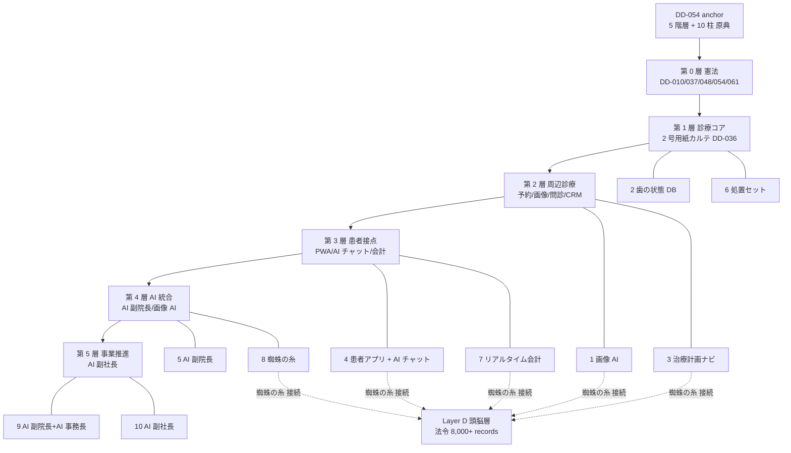

# Dashboard Layer A 構想層 render component (= cmd_020 sub-section)

**Status**: ashigaru1 起案 v0.1、subtask_cmd020_dashboard_layer_a_kousou_render
**Parent design**: `docs/dashboard_design_v0.1.md §2` (= 主 source、5 階層 + 10 柱 + 蜘蛛の糸 原本) + `docs/dashboard_design_v0.2.md §2` (= retain reference、変更なし)
**Scope**: 本 doc は **Layer A 構想層単独 sub-section markdown render component**。Layer B-F は別 task。
**Repo**: multi-agent-shogun-newbuild (= hakudokai-dev は本 task 範囲外)
**MC 統合**: MC `regenerate_dashboard.py` 等 generator artifact 不在 (= 直政検出)、本 doc は SC docs 起案のみ。MC 統合 interface は後段別 task。

---

## 1. 設計原典 anchor (= source-of-truth)

| anchor | source | 用途 |
|---|---|---|
| **DD-054** anchor (= 統合構想 v1.1 系) | DentalBI project `project_documents` (= 本 repo 外、Supabase fetch 想定) | 5 階層 + 10 柱 原典 |
| `docs/dashboard_design_v0.1.md` §2 | 本 repo (= 信長起草 2026-05-11) | 5 階層 + 10 柱 + 蜘蛛の糸 構造 |
| `docs/dashboard_design_v0.2.md` §2 | 本 repo (= 黒田 audit 反映、§2 retain) | v0.1 §2 retain reference |
| 蜘蛛の糸 (= DD-020 法令 6 本目) | Layer D 頭脳層 (= 8,000+ records、別 sub-section 担当) | Layer A から Layer D へ cross-layer 接続 anchor |

---

## 2. 5 階層 (= DentalBI 全体構造、第 0 層 〜 第 5 層)

第 0 層を憲法に据え、第 1 層 診療コアから第 5 層 事業推進まで階層的に積み上げる。各層の中項目 + 主要 DD 引用は本 sub-section の責任、各 DD の正本 status は別 layer 担当。

### 2.1 5 階層 table

| 大項目 | 中項目 | 主要 DD / 機能 anchor |
|---|---|---|
| **第 0 層 憲法** | DD-010 / DD-037 / DD-048 / **DD-054** / DD-061 等 最上位憲法群 | 各 DD version + 最終更新 (= Supabase `project_documents` 経由) |
| **第 1 層 診療コア** | 2 号用紙カルテ (= DD-036 原点) + DD-034 / 038 / 043 / 044 / 035 / 009 / 025 | 各 DD impl status、診療現場の不可逆基底 |
| **第 2 層 周辺診療** | 予約 (= phaseB) / 画像管理 / 問診 / 申し送り / CRM / リコール / 日計表 (DD-042) / 自費見積 (DD-045) | 機能別 status、診療コア周縁の支援機能 |
| **第 3 層 患者接点 (= 会計待ちゼロ)** | 患者アプリ PWA / AI チャット / 領収書 / SMS / 治療計画 / カード決済 / 高速会計 | 7 機能、cmd_004 二大戦線主戦場 |
| **第 4 層 AI 統合** | **蜘蛛の糸** / AI 副院長 / 画像 AI / 7 エンジン | 機能別、Layer D 頭脳層 (= 8,000+ records) と連結 |
| **第 5 層 事業推進** | AI 副社長 / 研究会会費制 | 機能別、5-10 年 horizon の事業 layer |

= **本 table は `docs/dashboard_design_v0.1.md §2` を Layer A 構想層単独 sub-section として再 render したもの**。

### 2.2 第 0 層〜第 5 層 の繋がり (= 縦軸 vs 横軸)

- **縦軸 (= 階層深さ)**: 第 0 層 (憲法) → 第 1 層 (診療コア) → … → 第 5 層 (事業) の階層化。下位層は上位層憲法に逆らえない。
- **横軸 (= 蜘蛛の糸)**: 第 4 層 AI 統合に位置する蜘蛛の糸が、Layer D 頭脳層と接続し、第 0-5 層を横断する法令層を提供する (= 「蜘蛛の糸 layer 接続 anchor」)。
- **DD-054 anchor**: 5 階層 + 10 柱 統合構想の原典 anchor、本 sub-section の正本 source。

---

## 3. 10 柱 (= 機能横断の柱、cmd_004 二大戦線基幹)

10 柱は階層と直交する **機能横断の柱**。1 つの柱が複数階層に貫通し、Layer C 機能層から見ると個別機能に分解される。

### 3.1 10 柱 table

| # | 柱 | 主要関連階層 | 蜘蛛の糸接続 |
|---|---|---|---|
| 1 | 画像 AI | 第 1-2 層 (診療コア + 周辺) + 第 4 層 (AI 統合) | 有 (= 画像所見と法令整合) |
| 2 | 歯の状態 DB | 第 1 層 (診療コア) | 有 (= マスター連携) |
| 3 | 治療計画ナビ | 第 1-3 層 (診療 + 患者接点) | 有 (= DD 法令 link) |
| 4 | 患者アプリ + AI チャット | 第 3 層 (患者接点) | 有 (= 同意 + UX 法令) |
| 5 | AI 副院長 | 第 4 層 (AI 統合) | 有 (= 副院長判断の法令根拠) |
| 6 | 処置セット | 第 1-2 層 (診療コア + 周辺) | 有 (= レセ整合) |
| 7 | リアルタイム会計 | 第 3 層 (患者接点) | 有 (= 会計待ちゼロ法令) |
| 8 | **蜘蛛の糸** | 第 0-5 層全層 (= 法令 cross-cutting) | 自身が接続主体 |
| 9 | AI 副院長+AI 事務長 | 第 4-5 層 (AI + 事業) | 有 (= 経営判断 audit) |
| 10 | AI 副社長 | 第 5 層 (事業推進) | 有 (= 事業 + 規範整合) |

### 3.2 10 柱の責任分担 (= Layer A vs 他 Layer)

- **Layer A (= 本 sub-section)**: 10 柱の **名前 + 関連階層 + 蜘蛛の糸接続有無** の anchor 提示のみ。
- **Layer B Phase 層**: 10 柱の実装 phase 進捗 (= 別 sub-section)。
- **Layer C 機能層**: 10 柱を機能単位に分解した cmd_004 二大戦線進捗 (= 別 sub-section)。
- **Layer D 頭脳層**: 蜘蛛の糸 8,000+ records 本体 (= 別 sub-section)。

= **本 sub-section は 10 柱の構想 anchor のみ**、進捗 / 機能 / 法令本体は各 Layer 担当 sub-section に委譲する (= 単一責任、self-contained)。

---

## 4. 構造可視化 (= mermaid graph TD)

下記 mermaid block は 5 階層 + 10 柱 + 蜘蛛の糸接続を text-based で可視化する (= pre-render 不要、markdown viewer 側で描画)。

= **graph TD** 形式で `graph TD` declaration を含む。階層と 10 柱を実線、Layer D 蜘蛛の糸接続を破線 (= 横軸 anchor) で表記。

---

## 5. cross-layer reference anchor

本 Layer A sub-section から他 Layer への接続 anchor は以下:

- **Layer B Phase 層**: 10 柱の実装 phase 進捗 (= phase1-6 / phaseB / C / D 等) は別 sub-section
- **Layer C 機能層**: cmd_004 二大戦線 (= 会計待ちゼロ / 小児恐竜王国 / 申し送りエンジン / 第一段階 PDF) は別 sub-section
- **Layer D 頭脳層**: 蜘蛛の糸 8,000+ records 本体 (= `legal_sources` / `legal_source_linkages` / `inspection_*` / `procedure_codes_audit` / `master_*`) は別 sub-section
- **Layer E 運用層**: agent 稼働状態 + systemd unit 状態は別 sub-section
- **Layer F 規範層**: memory MCP entity 群は別 sub-section

= 本 sub-section は **構想 anchor only**、本体は各 Layer に委譲する。

---

## 6. 既知の限界 + 後段別 task

| 限界 | 対応 |
|---|---|
| DD-054 原典は本 repo 外 (= DentalBI Supabase `project_documents`) | 本 sub-section は anchor 名のみ、本文 fetch は MC 統合 generator 側 後段別 task |
| MC `regenerate_dashboard.py` 等 generator artifact 不在 (= 直政検出) | 本 task は SC docs 起案単独、家康殿 + 秀吉殿合議結果着後別 task で統合 |
| 蜘蛛の糸 8,000+ records 本体 | Layer D 担当 sub-section へ委譲 |
| progress % 機械算出 | `docs/dashboard_design_v0.2.md §3.6` 機械算出式定義済、本 sub-section は anchor のみ |

---

## 7. 起案完了基準 (= 本 sub-section AC alignment)

- 「5 階層」 section (= §2) 単独 anchor 存在
- 「10 柱」 section (= §3) 単独 anchor 存在
- mermaid `graph TD` block (= §4) を含む構造可視化
- `DD-054` anchor (= §1 + §2.2 + §4 mermaid root) 参照
- 蜘蛛の糸 layer 接続 anchor (= §3.1 全行 + §4 mermaid 破線) 参照

= 上記 5 anchor を含む単独 markdown であり、`scripts/test/test_dashboard_layer_a_static_contract.py` で機械検証する。

---

*起案: ashigaru1、2026-05-11T22:25、parent design v0.1 §2 主 source + v0.2 §2 retain reference*
