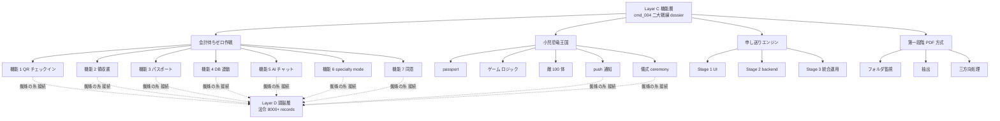

# Dashboard Layer C 機能層 render component (= cmd_020 sub-section)

**Status**: ashigaru3 起案 v0.1、subtask_cmd020_dashboard_layer_c_function_render
**Parent design**: `docs/dashboard_design_v0.1.md §2 Layer C` (= 主 source、cmd_004 二大戦線 dossier v1.1 原本) + `docs/dashboard_design_v0.2.md §2` (= v0.1 retain reference) + `docs/dashboard_design_v0.3-sc.md §4.1` (= 香椎照葉実証 leaf 補助 anchor)
**Scope**: 本 doc は **Layer C 機能層単独 sub-section markdown render component**。Layer A は ashigaru1 既起案、Layer B/D/E/F は別 task。
**Repo**: multi-agent-shogun-newbuild (= hakudokai-dev は本 task 範囲外)
**MC 統合**: MC `regenerate_dashboard.py` 等 generator artifact 不在 (= 本 SC repo 内 find 0 件)、本 doc は SC docs 起案のみ。MC 統合 interface は家康 + 秀吉合議結果着後の別 task。

---

## 1. 設計原典 anchor (= source-of-truth)

| anchor | source | 用途 |
|---|---|---|
| `docs/dashboard_design_v0.1.md` §2 Layer C | 本 repo (= 信長起草 2026-05-11) | cmd_004 二大戦線 dossier v1.1 原本 table |
| `docs/dashboard_design_v0.2.md` §2 | 本 repo (= 黒田 audit 反映、§2 retain) | v0.1 §2 retain reference |
| `docs/dashboard_design_v0.3-sc.md` §4.1 | 本 repo (= 直政起案、SC 視点 #1 香椎照葉 leaf) | 実装/実証 分離設計の補助 anchor |
| `docs/dashboard_layer_a_kousou.md` §5 | 本 repo (= ashigaru1 起案、cross-layer reference) | Layer A 先例の Layer C reference に呼応する本体 |
| 蜘蛛の糸 (= DD-020 法令 6 本目) → Layer D 頭脳層 | Layer D 担当 sub-section (= 後段別 task) | Layer C 機能から Layer D へ cross-layer 接続 anchor |
| cmd_004 機能本体 design docs | `docs/cmd004_patient_app_pwa_design.md` / `docs/cmd004_notification_facade_design.md` / `docs/cmd004_observability_design.md` / `docs/cmd004_security_hardening_design.md` / `docs/cmd004_cicd_pipeline_design.md` / `docs/moushi_engine_ui_design_v0.1.md` | 本 Layer C render は dashboard anchor 化のみ、機能本体は別 design doc |

---

## 2. cmd_004 二大戦線 dossier (= Layer C 主戦場)

cmd_004 の二大戦線は **会計待ちゼロ作戦** と **小児恐竜王国** であり、DentalBI 第 3 層 患者接点を主戦場とする。本 sub-section は両戦線 + 申し送りエンジン + 第一段階 PDF 方式の dashboard anchor を提示する。各機能本体 status は MC 側 generator が `queue/reports/` + Supabase `development_progress` を統合 fetch する想定で、SC docs は anchor + 構造のみを担う。

### 2.1 二大戦線 sub-section (= 戦線別 大項目)

| 戦線 | 大項目 | 担当 ashigaru anchor | 完遂率 field | 蜘蛛の糸 layer 接続 |
|---|---|---|---|---|
| **会計待ちゼロ作戦** | 患者会計 7 機能 (= 機能 ①-⑦) + PWA + 通知 + 観測性 + security + CI/CD | ashigaru3 (= phase_1_6 chain Phase 1-7 + 本 Layer C render) | 完遂率: MC generator 算出 (= `docs/dashboard_design_v0.2.md §3.6` 式) | 有 (= 会計法令 + 同意 法令 + 領収書要件、Layer D へ接続) |
| **小児恐竜王国** | passport + ゲーム + 敵 100 体 + push + 儀式 + ceremony | ashigaru3 (= push_vapid + facade 経由) | 完遂率: MC generator 算出 | 有 (= COPPA + 保護者同意 + 患者個人情報、Layer D へ接続) |

= **会計待ちゼロ** + **小児恐竜王国** = cmd_004 二大戦線、両戦線とも蜘蛛の糸経由で Layer D 頭脳層へ接続する。

### 2.2 申し送りエンジン sub-section (= 二大戦線基盤)

申し送りエンジンは二大戦線を支える **多機能 base infra**。`docs/moushi_engine_ui_design_v0.1.md` に Stage 1/2/3 設計が既起案、トンカツ・ハマカツ多階層タップ UI pattern が成功した場合、25 form 全体への template 化展開が Layer A 構想層 future state として可視化される (= v0.3-sc §4.2)。

| 大項目 | 中項目 | 担当 ashigaru | 完遂率 anchor |
|---|---|---|---|
| **申し送りエンジン** | 4 人合議 design + Stage 1 (= UI) + Stage 2 (= backend) + Stage 3 (= 統合運用) | 既起案 owner | Stage 別 status、MC generator 算出 |

### 2.3 第一段階 PDF 方式 sub-section (= 補助戦線)

第一段階 PDF 方式は **フォルダ監視 + 抽出 + 三方向処理** の 3 module 構成、cmd_004 dossier v1.1 内補助戦線として位置づけられる。本 sub-section では anchor 提示のみ、cycle status は MC generator 担当。

| 大項目 | 中項目 | 完遂率 anchor |
|---|---|---|
| **第一段階 PDF 方式** | フォルダ監視 / 抽出 / 三方向処理 | MC generator 算出 |

---

## 3. 機能①-⑦ status table (= 会計待ちゼロ 7 機能 個別 anchor)

会計待ちゼロ作戦の 7 機能個別 anchor。各機能の cycle / audit / shogun_verified / commit_hash は MC 側 generator が個別 fetch する想定で、本 sub-section は **機能 ID + 名称 + 蜘蛛の糸接続 + 完遂率 field** のみを提示する。

### 3.1 機能①-⑦ table

| # | 機能 anchor | 主要関連 | 蜘蛛の糸 layer 接続 | 完遂率 anchor |
|---|---|---|---|---|
| 機能 ① | QR チェックイン | 患者来院 entrypoint | 有 (= 来院時刻 + 患者 ID 法令整合) | MC generator 算出 |
| 機能 ② | 領収書 | 会計 + 領収書発行 | 有 (= 領収書要件 法令整合) | MC generator 算出 |
| 機能 ③ | パスポート | 患者 ID 管理 + 来院履歴 | 有 (= 個人情報法令整合) | MC generator 算出 |
| 機能 ④ | DB 連動 | 受診 + 会計 + master 連動 | 有 (= マスター連携 法令整合) | MC generator 算出 |
| 機能 ⑤ | AI チャット | 患者 ↔ AI 副院長 + 同意 | 有 (= AI 説明同意 法令整合) | MC generator 算出 |
| 機能 ⑥ | specialty_mode | 専門医 mode 切替 | 有 (= 専門医基準 法令整合) | MC generator 算出 |
| 機能 ⑦ | 同意 | 治療同意 + COPPA + 保護者 | 有 (= 同意法令 + COPPA 整合) | MC generator 算出 |

= **本 table は機能①-⑦ 個別 anchor を Layer C 機能層単独 sub-section として再 render したもの**。

### 3.2 機能①-⑦ と蜘蛛の糸 接続の意味

会計待ちゼロ 7 機能は **全件** 蜘蛛の糸経由で Layer D 頭脳層 (= 法令 8,000+ records) と接続する。これは患者会計が **療担規則 + 厚労省告示 + 緑本 + 赤本** 全層に支配されるためで、機能個別の audit 時点で蜘蛛の糸法令 cross-check が機械実行される。

---

## 4. 完遂率 field 設計 (= 機械算出 anchor)

本 sub-section の各機能 / 戦線の **完遂率 field** は `docs/dashboard_design_v0.2.md §3.6 progress 算出式` に従い MC generator が機械算出する。本 Layer C render markdown は **完遂率 anchor (= field 名 + 算出 source 参照)** のみを提示し、実数値の埋込は行わない (= 本 doc 静的、数値は generator 動的 fetch)。

### 4.1 完遂率 算出 source 参照 anchor

| 完遂率 source | 算出根拠 |
|---|---|
| leaf 完遂率 | `status` + `verdict` + `shogun_verified` + `audited_done` + `evidence_state` field (= v0.2 §3.6) |
| 親 node 完遂率 | `sum(weight × child_progress) / sum(weight)` 加重平均 (= v0.2 §3.6) |
| weight | 陛下御差配 priority A=3 / B=2 / C=1、未指定 1 (= v0.2 §3.6) |
| 色分け | green ✅ 100% / yellow 🟡 50-99% / orange 25-49% / red 🔴 0-24% or blocked (= v0.2 §3.6) |

= **完遂率 field は anchor only**、実数は MC generator が動的算出して dashboard.md/html に render する。

---

## 5. 構造可視化 (= mermaid graph TD)

下記 mermaid block は Layer C 機能層内構造 (= 二大戦線 + 申し送り + PDF + 機能①-⑦ + 蜘蛛の糸接続) を text-based で可視化する (= pre-render 不要、markdown viewer 側で描画)。

= **graph TD** 形式で `graph TD` declaration を含む。二大戦線 + 申し送り + PDF を実線、Layer D 蜘蛛の糸接続を破線 (= 横軸 anchor) で表記。機能①-⑦ 全件 + 小児恐竜王国 push/儀式 を蜘蛛の糸経由で Layer D へ接続。

---

## 6. cross-layer reference anchor

本 Layer C sub-section から他 Layer への接続 anchor は以下:

- **Layer A 構想層**: DD-054 5 階層 + 10 柱 + 蜘蛛の糸 anchor は `docs/dashboard_layer_a_kousou.md` (= ashigaru1 既起案、本 Layer C は Layer A の 10 柱を機能単位に分解した実装 layer)
- **Layer B Phase 層**: cmd_004 phase / phaseB / phaseC / phaseD 実装 phase 進捗は別 sub-section
- **Layer D 頭脳層**: 蜘蛛の糸 8,000+ records 本体 (= `legal_sources` / `legal_source_linkages` / `inspection_*` / `procedure_codes_audit` / `master_*`) は別 sub-section、本 Layer C は接続 anchor のみ提示
- **Layer E 運用層**: 機能担当 ashigaru の稼働状態は別 sub-section、本 Layer C は担当 ashigaru anchor のみ提示
- **Layer F 規範層**: 機能起案時の規範 (= F007 / pre_audit / model_selection 等) は別 sub-section
- **Status classification logic**: `docs/dashboard_status_classification_logic.md` (= ashigaru7 起案、Axis B task-state 軸 = 3 分類 implementation_required=🔴 red / monitor=🟡 yellow with trigger / manifest_pending=🟠 orange with W9 ref + pass_with_concerns visual rule + audited-blocked 12 件 status 整合 table)。本 Layer C 子項目 (= C-1〜C-15-B7) の Axis B 分類は本 reference を canonical source として参照、改変はしない。

= 本 sub-section は **機能 anchor + 構造 + 接続 only**、本体は各 Layer + 機能 design doc に委譲する (= 単一責任、self-contained)。

---

## 7. 既知の限界 + 後段別 task

| 限界 | 対応 |
|---|---|
| cmd_004 機能本体 status は本 repo 外 (= Supabase `development_progress` + `queue/reports/`) | 本 sub-section は anchor + 完遂率 field 名のみ、実数 fetch は MC 統合 generator 側 後段別 task |
| MC `regenerate_dashboard.py` 等 generator artifact 不在 (= 直政検出継承) | 本 task は SC docs 起案単独、家康 + 秀吉合議結果着後別 task で MC SoT 統合 |
| 蜘蛛の糸 8,000+ records 本体 | Layer D 担当 sub-section へ委譲 |
| 完遂率 機械算出 | `docs/dashboard_design_v0.2.md §3.6` 算出式 + MC generator 担当、本 sub-section は anchor のみ |
| 香椎照葉実証 leaf (= v0.3-sc §4.1) | clinic_id=5 25 form 検証 task の leaf 配置 anchor、本体 status は MC generator 担当 |

---

## 8. 起案完了基準 (= 本 sub-section AC alignment)

- 「cmd_004 二大戦線」 section (= §2、会計待ちゼロ + 小児恐竜王国 両 section) 単独 anchor 存在
- 「機能①-⑦」 anchor (= §3.1 table) 全 7 件存在
- 「申し送りエンジン」 section (= §2.2) 単独 anchor 存在
- 「蜘蛛の糸」「Layer D」 cross-layer reference anchor (= §1 + §5 mermaid 破線 + §6 cross-layer) 存在
- 「完遂率」 field anchor (= §2 各 table + §4 算出 source 参照) 存在
- mermaid `graph TD` block (= §5) を含む構造可視化

= 上記 6 anchor を含む単独 markdown であり、`scripts/test/test_dashboard_layer_c_static_contract.py` で機械検証する。

---

*起案: ashigaru3、2026-05-12T11:18、parent design v0.1 §2 Layer C 主 source + v0.2 §2 retain reference + v0.3-sc §4.1 補助 anchor、ashigaru1 Layer A 先例規範踏襲*
