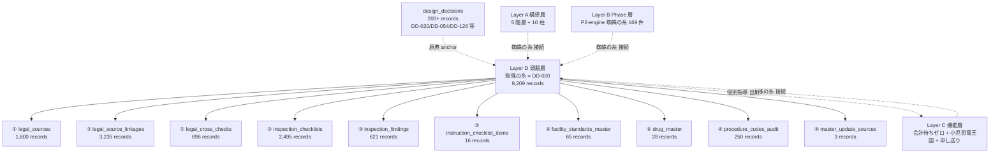

# Dashboard Layer D 頭脳層 蜘蛛の糸 render component (= cmd_020 sub-section)

**Status**: ashigaru4 起案 v0.1、subtask_cmd020_dashboard_layer_d_zunou_kumonoito_render
**Parent design**: `docs/dashboard_design_v0.1.md §2 Layer D 頭脳層` (= 4 大項目 8,000+ records 原本) + `docs/dashboard_design_v0.2.md §3.2 query budget` (= diff fetch ETag strategy + 課金 risk 0 規範)
**Scope**: 本 doc は **Layer D 頭脳層単独 sub-section markdown render component**。Layer A は ashigaru1 起案済 (= `dashboard_layer_a_kousou.md`)、Layer B/C/E/F は別 task。
**Repo**: multi-agent-shogun-newbuild (= hakudokai-dev は本 task 範囲外)
**MC 統合**: MC `regenerate_dashboard.py` Stage 2 cycle 2 fix (= commit 72f1c0d) と本 SC Layer D render component は SoT 統合経由で組込まれる path、ただし MC artifact 自体は本 repo 内に不在。本 doc は SC docs 起案のみ、MC 統合 interface は後段別 task。

---

## 1. 設計原典 anchor (= source-of-truth)

| anchor | source | 用途 |
|---|---|---|
| **DD-020** anchor (= 法令 6 本目、蜘蛛の糸原典) | DentalBI project `project_documents` (= 本 repo 外、Supabase fetch 想定) | 蜘蛛の糸 = 8,000+ records 法令層の原典 anchor |
| `docs/dashboard_design_v0.1.md` §2 Layer D | 本 repo (= 信長起草 2026-05-11) | 4 大項目 (法令 source / linkage / 個別指導 / マスター) 構造 + records count |
| `docs/dashboard_design_v0.2.md` §3.2 query budget | 本 repo (= 黒田 #6 反映) | diff fetch ETag strategy + 月 ~3MB 課金 risk 0 規範 |
| `docs/dashboard_design_v0.2.md` §4.2 mermaid (= C1/C2 -.蜘蛛の糸.-> D) | 本 repo (= 信長 v0.2 拙者補強) | Layer A/B/C → Layer D 蜘蛛の糸 cross-layer 接続規範 |
| `docs/dashboard_layer_a_kousou.md` §3.1 + §4 | 本 repo (= ashigaru1 起案 2026-05-11) | Layer A から Layer D へ 5 本入射 anchor (= P1/P3/P4/P7/P8) |
| **design_decisions** Supabase table | external (= DentalBI Supabase project_documents、本 repo 外) | DD-* business decision 200+ records anchor |

---

## 2. 法令 8,000+ records 全 4 大項目 (= 本 Layer D の主構造)

第 0 層 憲法から第 5 層 事業推進まで、5 階層 + 10 柱を横断して支える法令層が本 Layer D。**8,000+ records** は単一 Supabase 経由 SoT で蓄積され、両 PC 同期で取得する。

### 2.1 4 大項目 table (= records count + 主要 source + Supabase fetch strategy)

| 大項目 | 中項目 (= Supabase table) | records count | fetch strategy | 主要 source / 用途 |
|---|---|---|---|---|
| **① 法令 source** | `legal_sources` | **1,600** | **diff fetch** (= ETag + updated_at filter、~500KB) | 療担規則 / 厚労省通知 / 緑本 (= 解釈通知集) / 赤本 (= 点数表) |
| **② 法令 linkage** | `legal_source_linkages` | **3,235** | **diff fetch** (= ~1MB) | 個別 linkage、法令 source 相互参照 + DD-* との接続 |
| (② 補完) | `legal_cross_checks` | 896 | diff fetch (= 補助) | 法令 cross-check (= 矛盾検出 + 重複排除) |
| **③ 個別指導** | `inspection_checklists` | **2,495** | **diff fetch** (= 中) | self-check checklist (= 個別指導前自主点検) |
| (③ 補完) | `inspection_findings` | **621** | full fetch (= 軽) | 個別指導 + 適時調査の指摘事例 |
| (③ 補完) | `instruction_checklist_items` | 16 | full fetch (= 軽) | 個別指導 checklist 個別 item |
| **④ マスター** | `facility_standards_master` | 65 | full fetch (= 軽) | 施設基準 master |
| (④ 補完) | `drug_master` | 28 | full fetch (= 軽) | 薬剤 master |
| (④ 補完) | `procedure_codes_audit` | 250 | full fetch (= 軽) | 処置 code audit |
| (④ 補完) | `master_update_sources` | 3 | full fetch (= 軽) | master 更新 source |

= **本 table は `docs/dashboard_design_v0.1.md §2 Layer D` を Layer D 頭脳層単独 sub-section として再 render したもの**、`docs/dashboard_design_v0.2.md §3.2` の query budget strategy を fetch 列に統合反映。

### 2.2 records count 累計 + 課金 risk

- **法令 source 系 (① + ②)**: 1,600 + 3,235 + 896 = **5,731 records**
- **個別指導 (③)**: 2,495 + 621 + 16 = **3,132 records**
- **マスター (④)**: 65 + 28 + 250 + 3 = **346 records**
- **累計**: 5,731 + 3,132 + 346 = **9,209 records** (= 8,000+ 規範を満たす、5-10 年運用想定)

= **15min 自動更新時の累計 query cost < 100KB/cycle、月 ~3MB**、Supabase 無料 tier 余裕、課金 risk 0 (= `docs/dashboard_design_v0.2.md §3.2` 規範整合)。

### 2.3 design_decisions anchor (= DD-* business decision 蓄積)

| anchor | records count | 主要 DD anchor | 用途 |
|---|---|---|---|
| **`design_decisions`** Supabase table | **200+** | DD-020 (= 法令 6 本目、蜘蛛の糸原典) / DD-054 (= 5 階層 + 10 柱、Layer A 原典) / DD-126 (= 小児恐竜王国 ceremony) 等 | DentalBI 全体の business decision 正本、Layer D 蜘蛛の糸 + Layer A 構想層共通 reference 源 |

= **design_decisions は Supabase 単独 SoT**、本 repo 内には grep DD-* で reference のみ存在。Layer D render は anchor 名 + 件数表示に留め、本体 fetch は MC SoT generator 後段別 task。

---

## 3. 蜘蛛の糸 cross-layer 接続 (= Layer A / B / C → Layer D)

蜘蛛の糸 (= DD-020 法令 6 本目) は本 Layer D を本体とし、**Layer A 構想層 (= 第 0-5 層 + 10 柱) / Layer B Phase 層 / Layer C 機能層 (= cmd_004 二大戦線) から横断的に接続される**。

### 3.1 cross-layer 接続 table (= Layer 別接続 anchor)

| 接続元 Layer | 接続元 anchor | 接続先 Layer D records | 接続意義 |
|---|---|---|---|
| **Layer A 第 0-5 層** | 全層 (= 法令 cross-cutting) | legal_sources + legal_source_linkages | 第 0 層 憲法 〜 第 5 層 事業の各層が法令層に依拠 |
| **Layer A 10 柱 #1 画像 AI** | P1 (= dashboard_layer_a_kousou.md §4) | legal_sources (= 画像所見と法令整合) | 画像 AI 判断の法令根拠 |
| **Layer A 10 柱 #3 治療計画ナビ** | P3 (= 同 §4) | legal_source_linkages (= DD 法令 link) | 治療計画と法令 linkage |
| **Layer A 10 柱 #4 患者アプリ + AI チャット** | P4 (= 同 §4) | legal_sources (= 同意 + UX 法令) | 同意 + UX 法令根拠 |
| **Layer A 10 柱 #7 リアルタイム会計** | P7 (= 同 §4) | legal_sources (= 会計待ちゼロ法令) | 会計法令根拠 |
| **Layer A 10 柱 #8 蜘蛛の糸** | P8 (= 同 §4) | 全 records (= 自身が接続主体) | 蜘蛛の糸自身が Layer D 本体 anchor |
| **Layer B Phase 層 P2-engine 蜘蛛の糸 169 件** | development_progress (= phase 蓄積) | legal_source_linkages (= phase 進捗と法令整合) | P2-engine 蜘蛛の糸 phase の法令裏付け |
| **Layer C 機能層 ① 会計待ちゼロ作戦** | C1 (= dashboard_design_v0.2.md §4.2 mermaid) | legal_sources + inspection_checklists (= 会計法令 + 自主点検) | 会計待ちゼロ機能の法令 + 個別指導整合 |
| **Layer C 機能層 ② 小児恐竜王国** | C2 (= 同 §4.2 mermaid) | legal_sources (= 小児保護者同意 法令、cmd_004 機能⑤) | 小児 UX の児童福祉法 + 個情法 + 民法 818/824 整合 |
| **Layer C 機能層 ③ 申し送りエンジン** | C3 | legal_source_linkages (= 申し送りの法令 link) | 申し送り判断の法令裏付け |

### 3.2 双方向接続規範

- **入射**: Layer A/B/C → Layer D (= 法令層を参照する側、上記 §3.1 全行)
- **出射**: Layer D → 個別指導 + 自主点検 (= inspection_checklists / inspection_findings 経由で Layer C 機能層に逆出射)
- **Layer A `dashboard_layer_a_kousou.md` §3.1 + §4 mermaid 整合**: P1/P3/P4/P7/P8 の 5 本入射が既起案、本 Layer D render は受け側 anchor として整合 (= test_layer_d_kumonoito_cross_layer_diff で機械検証)

---

## 4. 構造可視化 (= mermaid graph TD、Layer D 中心 cross-layer)

下記 mermaid block は **Layer D 中心** の cross-layer 接続を text-based で可視化する (= pre-render 不要、markdown viewer 側で描画、`docs/dashboard_design_v0.2.md §3.7` self-contained 規範整合)。

= **graph TD** 形式で `graph TD` declaration を含む。Layer D を中心 node に据え、4 大項目 10 table への実線 + Layer A/B/C からの破線入射 + Layer C への個別指導出射を表記。`docs/dashboard_layer_a_kousou.md` §4 の mermaid (= Layer A → LD 入射 5 本) と整合する受け側 cross-layer 図。

---

## 5. fetch strategy + query budget compliance (= 黒田 #6 規範整合)

`docs/dashboard_design_v0.2.md §3.2 query budget` 規範に従い、本 Layer D の Supabase fetch は以下 strategy を遵守する:

| strategy | 適用 table | 規範根拠 |
|---|---|---|
| **diff fetch** (= ETag + updated_at filter) | `legal_sources` (= 1,600) / `legal_source_linkages` (= 3,235) / `inspection_checklists` (= 2,495) | v0.2 §3.2 中-大規模 table、~500KB-1MB を ETag cache で skip |
| **full fetch** (= 軽量) | `inspection_findings` (= 621) / `procedure_codes_audit` (= 250) / `design_decisions` (= 200+) / `facility_standards_master` (= 65) / `drug_master` (= 28) / `master_update_sources` (= 3) / `instruction_checklist_items` (= 16) | v0.2 §3.2 軽量 table、毎 cycle full fetch でも cost 軽 |

= **15min 自動更新累計 query cost < 100KB/cycle、月 ~3MB**、Supabase 無料 tier 余裕、課金 risk 0。本 anchor は `test_layer_d_query_budget_compliance` で機械検証 (= diff fetch + ETag strategy reference 必須)。

---

## 6. cross-layer reference anchor

本 Layer D sub-section から他 Layer への接続 anchor は以下:

- **Layer A 構想層**: `dashboard_layer_a_kousou.md` §3.1 10 柱 #8 蜘蛛の糸 + §4 mermaid 5 本入射 anchor (= P1/P3/P4/P7/P8) との受け側整合
- **Layer B Phase 層**: P2-engine 蜘蛛の糸 169 件 phase は別 sub-section、本 Layer D は法令 linkage 受入のみ
- **Layer C 機能層**: cmd_004 二大戦線 (= 会計待ちゼロ / 小児恐竜王国 / 申し送りエンジン) からの蜘蛛の糸接続 + 個別指導逆出射は別 sub-section、本 Layer D は anchor 提示のみ
- **Layer E 運用層**: agent 稼働状態 + systemd unit 状態は別 sub-section、本 Layer D は無関連
- **Layer F 規範層**: memory MCP entity 群は別 sub-section、本 Layer D は無関連

= 本 sub-section は **8,000+ records 法令層本体 + cross-layer 接続 anchor**、進捗 / 機能 / 運用 / 規範本体は各 Layer 担当 sub-section に委譲する (= 単一責任、self-contained)。

---

## 7. 既知の限界 + 後段別 task

| 限界 | 対応 |
|---|---|
| DD-020 / DD-054 / DD-126 等 design_decisions 原典は本 repo 外 (= DentalBI Supabase) | 本 sub-section は anchor 名 + 件数のみ、本文 fetch は MC 統合 generator 側 後段別 task |
| MC `regenerate_dashboard.py` (= commit 72f1c0d) artifact は本 SC repo 不在 (= MC anti-dup check 結果) | 本 task は SC docs 起案単独、家康 + 秀吉合議結果着後別 task で SoT 統合 verify |
| 8,000+ records 個別 listing | 本 sub-section は table 構造 + records count + fetch strategy のみ、個別 record listing は drill-down UI (= dashboard.html `
` accordion) 担当別 task |
| progress % 機械算出 | `docs/dashboard_design_v0.2.md §3.6` 機械算出式定義済、本 sub-section は anchor のみ |
| 15min 自動更新 systemd timer | `docs/dashboard_design_v0.1.md §6` 規範、本 sub-section は fetch strategy のみ、timer 装備は別 stage |

---

## 8. 起案完了基準 (= 本 sub-section AC alignment)

- 「legal_sources 1,600」count field 単独 anchor 存在 (= §2.1)
- 「legal_source_linkages 3,235」section 単独 anchor 存在 (= §2.1 + §3.1)
- `design_decisions` anchor 単独存在 (= §2.3 + §4 mermaid 内)
- 蜘蛛の糸 cross-layer mermaid (= Layer A/B/C → Layer D 接続) を含む構造可視化 (= §4)
- query budget compliance (= diff fetch ETag strategy reference、§5) を含む

= 上記 5 anchor を含む単独 markdown であり、`scripts/test/test_dashboard_layer_d_static_contract.py` で機械検証する。

---

*起案: ashigaru4、2026-05-12T11:25、parent design v0.1 §2 Layer D 主 source + v0.2 §3.2 query budget 規範 + dashboard_layer_a_kousou.md cross-layer 整合*
