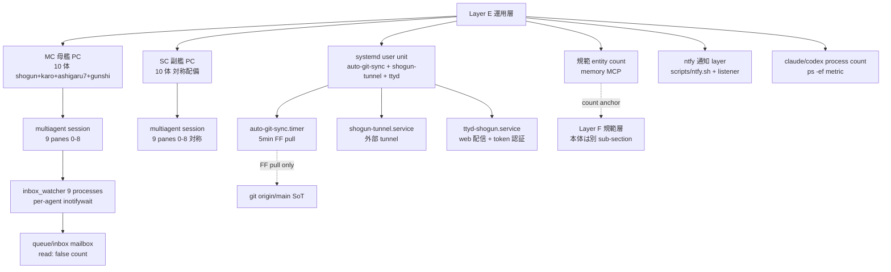

# Dashboard Layer E 運用層 render component (= cmd_020 sub-section)

**Status**: ashigaru5 起案 v0.1、subtask_cmd020_dashboard_layer_e_unyou_render
**Parent design**: `docs/dashboard_design_v0.1.md §2 Layer E` (= 主 source、運用層原本) + `docs/dashboard_design_v0.2.md §3.3 SoT + §3.6 progress 算出式` (= SoT + 機械算出 anchor)
**Scope**: 本 doc は **Layer E 運用層単独 sub-section markdown render component**。Layer A は既起案 (= `docs/dashboard_layer_a_kousou.md`)、Layer B/C/D/F は別 task。
**Repo**: multi-agent-shogun-newbuild (= hakudokai-dev は本 task 範囲外)
**MC 統合**: MC `regenerate_dashboard.py` 等 generator artifact 不在 (= 本 repo 内、ashigaru1 Layer A inventory と同 evidence)、本 doc は SC docs 起案のみ。MC 統合 interface は後段別 task。
**Render 規範**: 本 doc は **anchor + 取得 command + 算出式のみ** 記載、runtime 固定値 (= 「現在 9 panes active」等) は禁。generator (= 後段別 task) が runtime fetch して dashboard.md/html に流し込む規範。

---

## 1. 設計原典 anchor (= source-of-truth)

| anchor | source | 用途 |
|---|---|---|
| `docs/dashboard_design_v0.1.md` §2 Layer E | 本 repo (= 信長起草 2026-05-11) | 運用層 大中小項目 原本 (= MC/SC pane + systemd unit + 規範 entity) |
| `docs/dashboard_design_v0.2.md` §3.3 両 PC SoT | 本 repo (= 黒田 audit #7 反映) | 両 PC source-of-truth 整合 anchor |
| `docs/dashboard_design_v0.2.md` §3.6 progress 算出式 | 本 repo (= 黒田 audit #5 反映) | 機械判定 + color coding 4 段階 |
| **CLAUDE.md Communication Protocol** | 本 repo (= プロジェクト規範) | mailbox + inbox_watcher delivery 原典 |
| **CLAUDE.md Git Sync Protocol + auto-git-sync** | 本 repo (= 2026-05-11 装備) | systemd timer + FF pull-only 原典 |
| `docs/auto_git_sync_design.md` | 本 repo | auto-git-sync 設計書本体 |

---

## 2. 大項目 構造 (= MC + SC + systemd unit + 規範 entity)

Layer E 運用層は **拙者 system 稼働状態** を四大項目で表す。各大項目は中項目に分解、中項目は機械取得 command と算出式 anchor を持つ。

### 2.1 大項目 table

| 大項目 | 中項目 anchor | 算出 source |
|---|---|---|
| **MC** (= 母艦 PC) | shogun 1 + karo 1 + ashigaru 7 + gunshi 黒田 1 (= 10 体) | `ps -ef` + `tmux list-panes` + ratelimit log |
| **SC** (= 副艦 PC) | shogun 1 + karo 1 + ashigaru 7 + gunshi 直政 1 (= 10 体) | `ps -ef` + `tmux list-panes` + ratelimit log |
| **systemd unit** | auto-git-sync / shogun-tunnel / shogun-self-check / ttyd-shogun / openclaw-gateway 等 | `systemctl --user list-unit-files` + `systemctl --user status` |
| **規範 entity** | memory MCP entities 計測 (= 本体は Layer F、Layer E は count のみ) | `mcp__memory__read_graph` → entity count |

= **本 sub-section は構造 anchor のみ提示**、各値の正本 fetch は MC 統合 generator (= 後段別 task) に委譲する。

### 2.2 縦軸 vs 横軸

- **縦軸 (= host)**: MC ↔ SC の対称配備、各 host 独立 process tree、両 PC で計測値別個。
- **横軸 (= 共通基盤)**: systemd unit + memory MCP は両 PC 対称設計、SoT は git tracked dashboard.md (= `docs/dashboard_design_v0.2.md §3.3` 経由)。
- **HEAD 一致 verify**: auto-git-sync.timer 経由 5min 以内 FF pull、divergent 検出時 HALT (= CLAUDE.md Git Sync Protocol 規範)。

---

## 3. multiagent tmux session 9 panes (= 主 runtime anchor)

multiagent session は **9 panes 構成** (= karo 1 + ashigaru 7 + gunshi 1)。shogun は別 session `shogun:main.0` に分離されている (= shogun pane は陛下対話専用、agents pane と独立)。

### 3.1 9 panes table

| pane | agent_id | CLI | 役割 anchor |
|---|---|---|---|
| `multiagent:agents.0` | karo (= 本多忠勝) | claude | 家老、task 配信 + dashboard.md (= 規範差し戻り後は state source) 管理 |
| `multiagent:agents.1` | ashigaru1 | claude | 足軽 1 号、Layer A 既起案 担当 |
| `multiagent:agents.2` | ashigaru2 | claude | 足軽 2 号 |
| `multiagent:agents.3` | ashigaru3 | claude | 足軽 3 号 |
| `multiagent:agents.4` | ashigaru4 | claude | 足軽 4 号 |
| `multiagent:agents.5` | ashigaru5 | claude | 足軽 5 号、Layer E 本 doc 担当 |
| `multiagent:agents.6` | ashigaru6 | claude | 足軽 6 号 |
| `multiagent:agents.7` | ashigaru7 | claude | 足軽 7 号 |
| `multiagent:agents.8` | gunshi (= 直政 / 黒田) | codex | 軍師、Codex 監査担当 |

### 3.2 取得 command anchor (= runtime fetch、固定値 retain 禁)

```bash
# 9 panes 構造 verify
tmux list-panes -t multiagent:agents -F '#{pane_index} #{pane_id} #{pane_width}x#{pane_height}'

# 各 pane の agent_id (= tmux user option)
tmux display-message -t multiagent:agents.{N} -p '#{@agent_id}'

# inbox_watcher process per agent (= 9 watchers expected: shogun + karo + ashigaru1-7 + gunshi)
ps -ef | grep 'inbox_watcher.sh' | grep -v grep
```

= **本 table は anchor 提示のみ**、実 pane 状態 (= active / idle / blocked) は generator 経由 runtime fetch。

---

## 4. systemd user unit + auto-git-sync.timer (= 自動 sync 基盤)

両 PC pull-only 自動 sync 基盤。`scripts/auto_git_sync.sh` を `auto-git-sync.timer` (= systemd user timer、5min interval、`Persistent=true`、`OnBootSec=2min`) が trigger。

### 4.1 systemd user unit anchor

| unit | type | 状態 anchor | 役割 |
|---|---|---|---|
| `auto-git-sync.timer` | timer | enabled / active (= `systemctl --user list-unit-files` で verify) | 5min interval で `auto-git-sync.service` を trigger |
| `auto-git-sync.service` | oneshot service | static (= timer 経由起動) | `scripts/auto_git_sync.sh` 実行、FF pull のみ |
| `shogun-tunnel.service` | service | enabled / active | 外部 tunnel (= ttyd 経由 web 配信 連携) |
| `shogun-self-check.service` | service | (= 設計書記載、装備状況は runtime fetch) | shogun 自身の sanity check |
| `ttyd-shogun.service` | service | (= 設計書記載、shogun-tunnel と統合 path) | ttyd 経由 web 配信 |
| `openclaw-gateway` | (= 設計書記載) | (= 装備候補) | 外部 API gateway 候補 |

### 4.2 auto-git-sync 動作仕様 (= CLAUDE.md Git Sync Protocol 抜粋)

- **5min interval** で `git fetch + FF pull` のみ実行
- **divergent (non-FF) 検出時** → HALT + karo inbox notify、auto-merge 厳禁
- **working tree dirty 時** → `git stash` → pull → `git stash pop`
- **連続 HALT 3 回** → shogun inbox escalation notify
- **log**: `queue/reports/auto_sync_log.yaml` (= flock 経由 atomic append)
- **設計書**: `docs/auto_git_sync_design.md`、stop/start: `systemctl --user stop/start auto-git-sync.timer`

### 4.3 取得 command anchor

```bash
# systemd user unit 状態
systemctl --user list-unit-files | grep -E '(auto-git-sync|shogun-tunnel|ttyd|openclaw)'
systemctl --user is-active auto-git-sync.timer
systemctl --user status auto-git-sync.timer

# auto-git-sync log (= 直近 N 件)
tail -n 50 /home/hakudokai/projects/multi-agent-shogun-newbuild/queue/reports/auto_sync_log.yaml
```

---

## 5. inbox_watcher daemon (= 通信基盤)

agent-to-agent communication は file-based mailbox (= `queue/inbox/{agent}.yaml`) を `inbox_watcher.sh` per-agent process が `inotifywait` で watch、変更検出時 tmux send-keys で短い nudge (= `inboxN`) を agent pane へ送信。

### 5.1 inbox_watcher anchor

| 要素 | 仕様 |
|---|---|
| **per-agent process** | 1 agent につき `scripts/inbox_watcher.sh {agent} {tmux_pane} {cli_kind}` 1 process |
| **watcher count** | shogun 1 + karo 1 + ashigaru 7 + gunshi 1 = **9 watcher processes** (= 期待値) |
| **supervisor** | `scripts/watcher_supervisor.sh` (= watcher daemon 監督、不整合 detect) |
| **mailbox** | `queue/inbox/{agent}.yaml` per-agent、flock 経由 atomic append |
| **delivery layer** | (1) file persistence (= `inbox_write.sh`) (2) wake-up signal (= `inbox_watcher.sh` → tmux send-keys) |
| **escalation** | 0-2min: 標準 nudge、2-4min: Escape×2 + nudge、4min+: `/clear` (= max once per 5min) |

### 5.2 取得 command anchor

```bash
# inbox_watcher processes 一覧
ps -ef | grep 'inbox_watcher.sh' | grep -v grep | wc -l   # 期待値 9 (= shogun + karo + ashigaru1-7 + gunshi)

# 各 agent mailbox の未読件数
for agent in shogun karo ashigaru1 ashigaru2 ashigaru3 ashigaru4 ashigaru5 ashigaru6 ashigaru7 gunshi; do
  unread=$(grep -c 'read: false' "/home/hakudokai/projects/multi-agent-shogun-newbuild/queue/inbox/${agent}.yaml" 2>/dev/null || echo 0)
  echo "${agent}: ${unread}"
done

# watcher_supervisor process (= 1 個想定)
ps -ef | grep 'watcher_supervisor.sh' | grep -v grep
```

---

## 6. ntfy + ttyd (= 通知 + web 配信 layer)

### 6.1 ntfy 通知 layer

| 要素 | 仕様 |
|---|---|
| `scripts/ntfy.sh` | ad-hoc 通知送信 script (= agent → 陛下 push) |
| `scripts/ntfy_listener.sh` | subscribe 側、外部 push trigger (= 陛下 → agent) |
| systemd unit | 不在 (= script-only、daemon 起動は手動 or supervisor 経由) |
| 用途 | 陛下 ↔ agent 緊急通知 layer (= rate limit / blocker / 完遂報告) |

### 6.2 ttyd 経由 web 配信 + 認証

| 要素 | 仕様 |
|---|---|
| `ttyd-shogun.service` | ttyd 経由 tmux session 配信 (= 設計書記載、shogun-tunnel と統合 path) |
| `shogun-tunnel.service` | 外部 tunnel (= systemd active enabled)、ttyd と連携 |
| 認証 | `config/ttyd_auth.env` token 認証 (= 既装備、`docs/dashboard_design_v0.2.md §3.7` 整合) |
| 外部 CDN | 不使用 (= self-contained、ネットワーク 依存 0、黒田 audit #4 evidence) |

### 6.3 取得 command anchor

```bash
# ntfy script 実在 verify
test -x /home/hakudokai/projects/multi-agent-shogun-newbuild/scripts/ntfy.sh
test -x /home/hakudokai/projects/multi-agent-shogun-newbuild/scripts/ntfy_listener.sh

# ttyd / shogun-tunnel 状態
systemctl --user is-active shogun-tunnel.service
ps -ef | grep ttyd | grep -v grep
```

---

## 7. claude / codex process count (= 稼働 metric)

各 pane で稼働している CLI session の process 数。`inbox_watcher.sh` の第 3 引数 (= `claude` / `codex`) で CLI 種別判定する規範。

### 7.1 claude process count anchor

| metric | 期待構造 |
|---|---|
| **claude process count** | shogun + karo + ashigaru 7 = 9 sessions (= claude CLI)、ratelimit で停止時減少 |
| **codex process count** | gunshi 1 session (= codex CLI、軍師専任) |
| **整合 verify** | inbox_watcher per-agent process と CLI process 数が一致 |

### 7.2 取得 command anchor

```bash
# claude process 数
ps -ef | grep -E '\\bclaude\\b' | grep -v grep | wc -l

# codex process 数
ps -ef | grep -E '\\bcodex\\b' | grep -v grep | wc -l
```

---

## 8. queue/inbox 状態 (= mailbox file state)

各 agent mailbox の未読件数 + 直近 timestamp。`CLAUDE.md Communication Protocol` で規定された file-based mailbox の state metric。

### 8.1 queue/inbox state anchor

| metric | 算出 |
|---|---|
| **per-agent unread count** | `grep -c 'read: false' queue/inbox/{agent}.yaml` |
| **per-agent 直近 timestamp** | YAML 最終 entry の `timestamp` field |
| **未消化 agent 一覧** | unread > 0 の agent (= karo escalation 候補) |
| **mailbox 総 entry count** | YAML 内 `- content:` 行数 |

### 8.2 取得 command anchor

```bash
# 全 agent mailbox 未読件数
for agent in shogun karo ashigaru1 ashigaru2 ashigaru3 ashigaru4 ashigaru5 ashigaru6 ashigaru7 gunshi; do
  f="/home/hakudokai/projects/multi-agent-shogun-newbuild/queue/inbox/${agent}.yaml"
  if [ -f "$f" ]; then
    unread=$(grep -c 'read: false' "$f")
    last_ts=$(grep 'timestamp:' "$f" | tail -1 | awk '{print $2}')
    echo "${agent}: unread=${unread} last_ts=${last_ts}"
  fi
done
```

---

## 9. 構造可視化 (= mermaid graph TD)

下記 mermaid block は Layer E 運用層 component 構造を text-based で可視化する (= pre-render 不要、markdown viewer 側で描画)。



= **graph TD** 形式で `graph TD` declaration を含む。Layer E 内構造を実線、SoT (= git origin) + Layer F (= 規範本体) への接続を破線で表記。

---

## 10. cross-layer reference anchor

本 Layer E sub-section から他 Layer への接続 anchor は以下:

- **Layer A 構想層**: 5 階層 + 10 柱 anchor は `docs/dashboard_layer_a_kousou.md` (= 既起案)
- **Layer B Phase 層**: 10 柱の実装 phase 進捗は別 sub-section
- **Layer C 機能層**: cmd_004 二大戦線進捗は別 sub-section
- **Layer D 頭脳層**: 蜘蛛の糸 8,000+ records は別 sub-section
- **Layer F 規範層**: memory MCP entity 本体は別 sub-section、Layer E は count metric anchor のみ

= 本 sub-section は **運用層 infra metric anchor only**、本体構想 / phase / 機能 / 法令 / 規範本体は各 Layer に委譲する (= 単一責任、self-contained)。

---

## 11. 既知の限界 + 後段別 task

| 限界 | 対応 |
|---|---|
| MC `regenerate_dashboard.py` 等 generator artifact 不在 (= ashigaru1 Layer A inventory と同 evidence) | 本 sub-section は anchor 提示のみ、runtime fetch は MC 統合 generator 側 後段別 task |
| ntfy 通知 layer に systemd unit 不在 (= script-only) | 装備候補、別 task で `ntfy-listener.{service,timer}` 起案検討 |
| `ttyd-shogun.service` / `shogun-self-check.service` / `openclaw-gateway` 設計書記載のみ (= 実装状況 runtime fetch) | 本 sub-section は anchor のみ、装備状況は generator runtime verify |
| runtime 固定値 (= 「現在 X 体 active」等) は本 doc に記載禁 (= stale 化原因) | 取得 command anchor + 算出式のみ記載、値 fetch は generator 委譲 |
| progress % 機械算出 | `docs/dashboard_design_v0.2.md §3.6` 既定義、本 sub-section は anchor のみ |

---

## 12. 起案完了基準 (= 本 sub-section AC alignment)

- 「tmux session 9 panes」 section (= §3) 単独 anchor 存在 (= `multiagent:agents.0` 〜 `agents.8` mention)
- 「auto-git-sync.timer」 section (= §4) 単独 anchor 存在 (= auto-git-sync mention)
- 「inbox_watcher」 section (= §5) 単独 anchor 存在 (= inbox_watcher.sh mention)
- 「ntfy + ttyd」 section (= §6) 単独 anchor 存在 (= ntfy + ttyd mention)
- 「systemd services anchor」 (= §4.1) timer / service anchor 存在
- mermaid `graph TD` block (= §9) を含む構造可視化
- `queue/inbox` mailbox anchor (= §8) 存在
- `claude process count` metric anchor (= §7) 存在

= 上記 anchor を含む単独 markdown であり、`scripts/test/test_dashboard_layer_e_static_contract.py` で機械検証する。

---

*起案: ashigaru5、2026-05-12T11:18、parent design v0.1 §2 Layer E 主 source + v0.2 §3.3 SoT + §3.6 progress 算出式 retain reference + CLAUDE.md Communication Protocol + Git Sync Protocol 原典*
